# 跟着李沐学AI

## 目录

- [跟着李沐学AI](#跟着李沐学ai)
  - [目录](#目录)
  - [安装](#安装)
  - [数据操作](#数据操作)
    - [访问元素](#访问元素)
    - [tensor](#tensor)
  - [线性代数](#线性代数)
    - [torch线性代数](#torch线性代数)
    - [矩阵计算（求导）](#矩阵计算求导)
      - [自动求导(计算图)](#自动求导计算图)
  - [线性回归](#线性回归)
    - [数据处理](#数据处理)
    - [数据迭代指针](#数据迭代指针)
    - [初始化模型参数](#初始化模型参数)
    - [定义线性模型](#定义线性模型)
    - [平方损失函数](#平方损失函数)
    - [梯度下降](#梯度下降)
    - [训练](#训练)
    - [使用pytorch实现](#使用pytorch实现)
  - [Softmax回归](#softmax回归)
    - [损失函数](#损失函数)
    - [基本概念](#基本概念)
      - [核心思想：](#核心思想)
    - [数学公式](#数学公式)
      - [原始分数（Logits）](#原始分数logits)
      - [Softmax 变换](#softmax-变换)
    - [完整实现](#完整实现)
    - [使用pytorch](#使用pytorch)
  - [感知机（Perceptron）](#感知机perceptron)
    - [基本概念](#基本概念-1)
      - [核心思想：](#核心思想-1)
    - [数学模型](#数学模型)
      - [基本结构](#基本结构)
      - [数学公式](#数学公式-1)
    - [几何解释](#几何解释)
      - [分类规则：](#分类规则)
  - [多层感知机](#多层感知机)
    - [基本概念](#基本概念-2)
  - [网络结构](#网络结构)
    - [标准架构](#标准架构)
    - [数学表示](#数学表示)
    - [激活函数](#激活函数)
    - [代码实现](#代码实现)
  - [模型选择](#模型选择)
    - [误差](#误差)
    - [数据集](#数据集)
      - [K折交叉验证](#k折交叉验证)
    - [过拟合和欠拟合](#过拟合和欠拟合)
    - [模型复杂度](#模型复杂度)
    - [VC维](#vc维)
    - [权重衰退](#权重衰退)
    - [丢弃法](#丢弃法)
    - [数值稳定性](#数值稳定性)
      - [模型初始化](#模型初始化)
  - [神经网络](#神经网络)
    - [层和块](#层和块)
    - [参数管理](#参数管理)
    - [卷积](#卷积)
    - [卷积的相关代码实现](#卷积的相关代码实现)
      - [自定义层和块](#自定义层和块)
      - [参数管理](#参数管理-1)
      - [卷积的多输入和多输出](#卷积的多输入和多输出)
      - [卷积](#卷积-1)
      - [卷积的填充和步幅](#卷积的填充和步幅)
    - [池化](#池化)
      - [代码实现](#代码实现-1)
    - [LeNet](#lenet)
    - [AlexNet](#alexnet)
    - [VGG](#vgg)
    - [NiN](#nin)
    - [GoogLeNet](#googlenet)
    - [批量归一化](#批量归一化)
      - [核心思想](#核心思想-2)
      - [计算步骤](#计算步骤)
      - [代码实现](#代码实现-2)
    - [ResNet](#resnet)
      - [残差块](#残差块)
      - [ResNet块细节](#resnet块细节)
      - [代码实现](#代码实现-3)
    - [DenseNet](#densenet)
      - [核心理念](#核心理念)
      - [数学公式](#数学公式-2)
      - [网络架构](#网络架构)
        - [Dense Block (密集块)](#dense-block-密集块)
        - [Transition Layer (过渡层)](#transition-layer-过渡层)
        - [增长率 (Growth Rate, $k$)](#增长率-growth-rate-k)
        - [代码实现](#代码实现-4)
    - [DarkNet-53(yoloV3)](#darknet-53yolov3)
      - [核心设计理念](#核心设计理念)
      - [Darknet-53 的具体结构层级](#darknet-53-的具体结构层级)
      - [关键组件](#关键组件)
  - [多GPU训练](#多gpu训练)
    - [代码实现](#代码实现-5)
    - [使用pytorch库实现](#使用pytorch库实现)
    - [结果(单GPU)](#结果单gpu)
  - [分布式训练](#分布式训练)
    - [数据并行](#数据并行)
    - [同步SGD](#同步sgd)
  - [计算机视觉](#计算机视觉)
    - [数据增强](#数据增强)
      - [常见的图像数据增强方法](#常见的图像数据增强方法)
      - [代码实现](#代码实现-6)
      - [使用数据增强的训练代码](#使用数据增强的训练代码)
    - [微调（迁移学习）](#微调迁移学习)
      - [代码实现](#代码实现-7)
    - [物体检测](#物体检测)
      - [绘制框](#绘制框)
      - [数据集](#数据集-1)
      - [锚框](#锚框)
      - [R-CNN 区域卷积神经网络](#r-cnn-区域卷积神经网络)
        - [算法流程：](#算法流程)
        - [运作原理：](#运作原理)
        - [Faster R-CNN：](#faster-r-cnn)
        - [Mask R-CNN:](#mask-r-cnn)
        - [双线性插值](#双线性插值)
      - [SSD 单发多框检测](#ssd-单发多框检测)
        - [核心思想：单次检测 (Single Shot)](#核心思想单次检测-single-shot)
        - [两个技术创新](#两个技术创新)
        - [SSD 算法完整执行流程](#ssd-算法完整执行流程)

## 安装

首先需要安装conda

创建虚拟环境：

```bash
conda create -n name python-3.8 pip
conda activate name
```

安装必要的包（这里是CPU版本的，推荐安装GPU版本的）：

```bash
pip install jupyter d2l torch torchvision
```

课件所有代码：

```bash
curl https://zh-v2.d2l.ai/d2l-zh-2.0.0.zip -o d2l-zh.zip
unzip d2l-zh.zip && rm d2l-zh.zip
```

进入对应框架目录启动课件服务：

```bash
jupyter notebook
```

## 数据操作

N维数组是机器学习和深度学习的基本数据结构。

### 访问元素

* 一个元素：[1,2]
* 一行：[1,:]
* 一列：[:,1]
* 子区域：[1:3, 1:]
* 子区域：[::3. ::2]

### tensor

```python
x = torch.arange(12)
# 1 2 3 4 ... 12
# x = torch.arange(12)
x.shape
# torch.Size([12])
x.reshape(3,4)
# tensor([[ 0, 1, 2, 3], [ 4, 5, 6, 7], [ 8, 9, 10, 11]])
torch.zeros((2,3,4))

torch.ones((2,3,4))

torch.cat([x,y], dim=0) # concatenate along rows

torch.cat([x,y], dim=1) # concatenate along columns

before = id(y)

y = y + x

id(y) == before
# false

A = x.numpy()

B = torch.from_numpy(A)

type(A), type(B)

# 插值

import pandas as pd

data = torch.arange(12, dtype=torch.float32)

data = data.reshape(4, 3)

data = pd.DataFrame(data.numpy(), columns=['a', 'b', 'c'])

# print(data)

inputs, outputs = data.iloc[:, 0:2], data.iloc[:, 2]

# print(inputs)

# print(outputs)

inputs = inputs.fillna(inputs.mean()) # 用均值填充缺失值

# print(inputs)

inputs = pd.get_dummies(inputs, dummy_na=True) # 独热编码

# print(inputs)

x,y = torch.tensor(inputs.values), torch.tensor(outputs.values)

x,y
```

## 线性代数

略。。。。

### torch线性代数

```python
A = torch.arange(20).reshape(5,4)

A.T # Transpose

B = torch.tensor([[1,2,3],[2,0,4],[3,4,5]])

print(B)

B == B.T # Check symmetry

A = B.clone()

A.sum(axis=1) # Sum all elements

print(B.float().mean() ) # Mean of all elements 均值

C = B.sum()/B.numel() # Alternative way to compute mean

sum_B = B.sum(axis=1, keepdim=True)

print(sum_B)

B / sum_B # Normalize rows to sum to 1

B.cumsum(axis=0) # Cumulative sum along rows

# Linear algebra operations

x = torch.ones(3, dtype=torch.float32)

y = torch.randn((1,2,3), dtype=torch.float32)

x, y, # torch.dot(x, y) # Dot product

B.shape, x.shape, torch.mv(B.float(), x) # Matrix-vector product

torch.mm(A.float(), B.float()) # Matrix-matrix product

torch.norm(torch.ones(4, dtype=torch.float32)) # Vector norm

```

### 矩阵计算（求导）

亚导数。。

#### 自动求导(计算图)

一个函数在给定值上的导数值。

链式法则：

1. 正向累积
2. 反向累计，反向传递

```python
import torch

x = torch.arange(4.0)

x.requires_grad_(True) # Enable gradient tracking

xx = torch.arange(4.0, requires_grad=True) # Alternative way to enable gradient tracking

x.grad # Get the gradient

y = 2* torch.dot(x, x)

y.backward() # Compute gradients

x.grad # Print the gradient d y / d x

x.grad == 4 * x

x.grad.zero_() # Reset gradients

x.grad

y = x.sum()

y.backward()

x.grad.zero_() # Reset gradients

y = x * x

y.sum().backward()

x.grad.zero_() # Reset gradients

y = x*x

u = y.detach() # Detach y from the computational graph

z = u * x

z.sum().backward()

x.grad # Gradient only flows through x

# x.grad == u

x.grad.zero_() # Reset gradients

y.sum().backward()

x.grad # No gradient flow through u
```

## 线性回归

### 数据处理

```python
def synthetic_data(w, b, num_examples): #@save
    """Generate y = Xw + b + noise.
    w: weight vector
    b: bias term
    num_examples: number of examples to generate
    """
    X = torch.normal(0, 1, (num_examples, len(w)))
    y = torch.matmul(X, w) + b
    y += torch.normal(0, 0.01, y.shape)
    return X, y.reshape((-1, 1))
true_w = torch.tensor([2, -3.4])
true_b = 4.2
features, labels = synthetic_data(true_w, true_b, 1000)

# 查看数据
print('features:', features[0],'nlabel:', labels[0])

# features: tensor([0.1220, 0.1381]) label: tensor([3.9699])
```

### 数据迭代指针

```python
def data_iter(batch_size, features, labels):
    """
    batch_size: size of each mini-batch
    features: input features
    labels: corresponding labels
    """
    # The number of examples
    num_examples = len(features)
    # Create a list of indices and shuffle them
    indices = list(range(num_examples))
    random.shuffle(indices) # Shuffle the dataset
    # Generate mini-batches
    for i in range(0, num_examples, batch_size):
        batch_indices = torch.tensor(
        indices[i: min(i + batch_size, num_examples)])
        # Return the mini-batch of features and labels
        # like C++ iterators
        # every time we call data_iter, it yields a new mini-batch
        yield features[batch_indices], labels[batch_indices]

batch_size = 10
for X, y in data_iter(batch_size, features, labels):
    print(X, 'n', y)   
    break
```

### 初始化模型参数

```python
# Initialize model parameters
# 2 features, so w has shape (2, 1)
# gradient tracking is enabled
w = torch.normal(0, 0.01, size=(2, 1), requires_grad=True)
# Initialize bias term
b = torch.zeros(1, requires_grad=True)
```

### 定义线性模型

```python
# Linear model

def linreg(X, w, b):
    """The linear regression model.    
    X: input features    
    w: weights    
    b: bias term
    """
    return torch.matmul(X, w) + b
```

### 平方损失函数

```python
# Squared loss function

def squared_loss(y_hat, y):
    """Squared loss function.    
    y_hat: predicted values    
    y: true values    
    """    
    return (y_hat - y.reshape(y_hat.shape))**2 / 2

```

### 梯度下降

不断通过沿着梯度的反方向更新参数求解

小批量随即梯度，选取b个样本

两个超参数，学习率（损失函数中的步长），批量大小

```python
# optimizer: stochastic gradient descent
def sgd(params, lr, batch_size):
    """Minibatch stochastic gradient descent.
    params: model parameters
    lr: learning rate
    batch_size: size of each mini-batch
    """
    with torch.no_grad():
        for param in params:
            # Update parameters using gradient
            # lr: learning rate
            # batch_size: to average the gradient
            param -= lr * param.grad / batch_size
            param.grad.zero_() # Reset gradients to zero after updating
```

### 训练

```python
lr = 0.03 # Learning rate
num_epochs = 3 # Number of epochs
net = linreg # Linear model
loss = squared_loss # Squared loss function

for epoch in range(num_epochs): # Loop over epochs
    for X, y in data_iter(batch_size, features, labels):
        l = loss(net(X, w, b), y) # Compute loss
        l.sum().backward() # Backpropagate to compute gradients
        sgd([w, b], lr, batch_size) # Update parameters using SGD
    with torch.no_grad():
        train_l = loss(net(features, w, b), labels)
        print(f'epoch {epoch + 1}, loss {float(train_l.mean()):f}')
```

输出：

```bash
epoch 1, loss 0.033290 
epoch 2, loss 0.000116 
epoch 3, loss 0.000049
```

误差打印：

```python
print(f"w的估计误差: {true_w - w.reshape(true_w.shape)}")
print(f"b的估计误差: {true_b - b}")

# w的估计误差: tensor([ 0.0002, -0.0008], grad_fn=<SubBackward0>) 
# b的估计误差: tensor([0.0002], grad_fn=<RsubBackward1>)
```

### 使用pytorch实现

```python
# Generate synthetic data
true_w = torch.tensor([2, -3.4])
true_b = 4.2
features, labels = d2l.synthetic_data(true_w, true_b, 1000)

# Create a data iterator

def load_array(data_arrays, batch_size, is_train=True):
    """Construct a PyTorch data iterator.
    Args:
    data_arrays: List of data arrays.
    batch_size: Size of each mini-batch.
    is_train: Boolean indicating whether to shuffle the data.
    Returns:
    A DataLoader object for iterating over the dataset.
    """
    dataset = data.TensorDataset(*data_arrays)
    return data.DataLoader(dataset, batch_size, shuffle=is_train)

batch_size = 10
data_iter = load_array((features, labels), batch_size)
next(iter(data_iter))

# Define a linear regression model
# 2 features, 1 output
net = nn.Sequential(nn.Linear(2, 1))
net[0].weight.data.normal_(0, 0.01)
net[0].bias.data.fill_(0)
loss = nn.MSELoss()
trainer = torch.optim.SGD(net.parameters(), lr=0.03)
num_epochs = 3

for epoch in range(num_epochs):
	for X, y in data_iter:
        l = loss(net(X), y)
        trainer.zero_grad()
        l.backward()
        trainer.step()
    l = loss(net(features), labels)
    print(f'epoch {epoch + 1}, loss {l:f}')
```

## Softmax回归

交叉熵通常用来衡量两个概率的区别：

### 损失函数

```python
# 1. L2损失
L = 0.5 (y - y_hat)**2

# 2. L1损失
L = abs(y-y_hat)

# 3. Huber Robust
L = abs(y-y_hat) -0.5	# abs(y-y_hat) > 1
L = 0.5 (y - y_hat)**2  # otherwise
```

### 基本概念

**Softmax 回归**（也称为多项逻辑回归）是**逻辑回归的多类别推广**，用于解决**多分类问题**（大于2个类别）。

#### 核心思想：

* 将原始分数（logits）转换为**概率分布**

* 确保所有类别的概率之和为 1

* 每个类别的概率在 $[0, 1]$范围内

### 数学公式

#### 原始分数（Logits）

对于每个类别 $j$，计算得分：
$z_j​=w_j^T ​x+b_j​$

#### Softmax 变换

将得分转换为概率：
$P(y=j∣x)=\frac{e^{z_j}}{\sum_{k=1}^K e^{z_k}}$

其中：

* $K$：类别总数

* $z_j$：类别 $j$ 的得分

* 分母是所有类别得分的指数和

### 完整实现

```python
batch_size = 256
train_iter, test_iter = d2l.load_data_fashion_mnist(batch_size)

# 将图像展平的输入是长度为 784 的向量，输出是长度为 10（类别） 的向量
num_inputs = 784
num_outputs = 10

# w 的形状是 (784, 10)，b 的形状是 (10, )
# 使用正态分布初始化权重参数
# 标准差为 0.01，均值为 0
# requires_grad=True 表示需要计算梯度以进行反向传播
w = torch.normal(0, 0.01, size=(num_inputs, num_outputs), requires_grad=True)
b = torch.zeros(num_outputs, requires_grad=True)

def softmax(X):
    X_exp = torch.exp(X)
    partition = X_exp.sum(1, keepdim=True)
    return X_exp / partition # 这里应用了广播机制

# 定义模型
def net(X):
    # X 展平成二维矩阵后，乘以权重矩阵，再加上偏差
    # -1: 表示这一维的大小由其他维度推断出来
    # 例如，假设 X 的形状是 (256, 1, 28, 28)，则展平后变成 (256, 784)
    # 然后与 w 矩阵相乘，得到形状为 (256, 10) 的矩阵，再加上偏差 b
    return softmax(torch.matmul(X.reshape((-1, w.shape[0])), w) + b)

# 实现交叉熵损失函数

def cross_entropy(y_hat, y):
	return -torch.log(y_hat[range(len(y_hat)), y])

def accuracy(y_hat, y):
    """计算预测正确的数量（用于评价指标计算）
    参数:
    y_hat (torch.Tensor): 模型的输出。可以是：
        - 形状为 (n, c) 的二维张量，每行表示每个样本对各类别的得分或概率；
        - 或形状为 (n,) 的一维张量，表示已经是预测的类别索引。
    y (torch.Tensor): 真实标签，形状为 (n,)，每个元素是类别索引（整型）。
    返回:
    float: 预测正确的样本数量（Python 浮点数）。
    """
    # 如果 y_hat 是二维的且第二维大于1，说明每行是对各类别的分数/概率，
    # 需要取每行最大值对应的索引作为预测类别（axis=1 表示按列方向取最大值的索引）
    if len(y_hat.shape) > 1 and y_hat.shape[1] > 1:
    	y_hat = y_hat.argmax(axis=1)
    # 比较预测类别与真实标签，得到布尔张量 cmp（True 表示预测正确）
    cmp = y_hat.type(y.dtype) == y
    # 将布尔值转换为数值（0/1），并求和得到正确预测的数量，最后转换为 Python float 返回
    return float(cmp.type(y.dtype).sum())

def evaluate_accuracy(net, data_iter):
    """计算在某个数据集上的准确率
    参数:
    net: 要评估的模型，可以是自定义函数或 torch.nn.Module
    data_iter: 数据迭代器，返回每个批次的 (X, y)
    返回:
    准确率（正确预测样本数 / 总样本数）
    """
    # 如果 net 是 torch.nn.Module 的实例，则将其切换到评估模式（影响 dropout、batchnorm 等）
    # 不计算梯度以节省内存和计算
    if isinstance(net, torch.nn.Module):
    	net.eval() # 评估模式：关闭 dropout，使用固定的 batchnorm 统计
    # 评估模式 (net.eval())：关闭 dropout，batchnorm 使用累计统计；
    # 训练模式 (net.train())：开启 dropout，batchnorm 使用当前批次统计
    # 使用 d2l 提供的累加器记录两个量：
    # metric[0] 累加正确预测的样本数，metric[1] 累加预测的总样本数
    metric = d2l.Accumulator(2)
    # 遍历数据集中的每个批次
    for X, y in data_iter:
        # net(X) 得到模型对该批次的输出（可以是概率或分数矩阵）
        # accuracy(net(X), y) 计算该批次中预测正确的样本数（返回 float）
        # y.numel() 返回该批次中样本的数量（即标签个数）
        metric.add(accuracy(net(X), y), y.numel())
    # 返回在整个数据集上的准确率：正确预测总数 / 样本总数
    return metric[0] / metric[1]

def train_epoch_ch3(net, train_iter, loss, updater):
    if isinstance(net, torch.nn.Module):
    	net.train() # 训练模式：开启 dropout，batchnorm 使用当前批次统计
    metric = d2l.Accumulator(3) # 训练损失总和，训练准确率总和，样本数
    for X, y in train_iter:
        # 计算梯度并更新参数
        y_hat = net(X)
        l = loss(y_hat, y)
        
        if isinstance(updater, torch.optim.Optimizer):
            # 使用 PyTorch 内置的优化器和损失函数
            updater.zero_grad()
            l.backward()
            updater.step()
            metric.add(float(l) * len(y), accuracy(y_hat, y), y.numel())
        else:
            # 使用自定义的优化器和损失函数
            l.sum().backward()
            updater(X.shape[0])
            metric.add(float(l.sum()), accuracy(y_hat, y), y.numel())
    # 返回训练损失平均值和训练准确率
    return metric[0] / metric[2], metric[1] / metric[2]

class Animator:
    def __init__(self, xlabel=None, ylabel=None, legend=None, xlim=None,
        ylim=None, xscale='linear', yscale='linear',
        fmts=('-', 'm--', 'g-.', 'r:'), nrows=1, ncols=1,
        figsize=(6, 4)):
        # 增量地绘制多条线
        if legend is None:
        	legend = []
        d2l.use_svg_display()
        self.fig, self.axes = d2l.plt.subplots(nrows, ncols, figsize=figsize)
        if nrows * ncols == 1:
        	self.axes = [self.axes, ]
        # 设置坐标轴
        for ax in self.axes:
            ax.set_xlabel(xlabel)
            ax.set_ylabel(ylabel)
            ax.set_xscale(xscale)
            ax.set_yscale(yscale)
            ax.set_xlim(xlim)
            ax.set_ylim(ylim)
            if legend:
            	ax.legend(legend)
        self.fmts = fmts
        self.X, self.Y = None, None
        
    def add(self, x, y):
        if not hasattr(y, "__len__"):
        	y = [y]
        n = len(y)
        if self.X is None:
        	self.X = [[] for _ in range(n)]
        if self.Y is None:
        	self.Y = [[] for _ in range(n)]
        for i in range(n):
            self.X[i].append(x)
            self.Y[i].append(y[i])
            self.axes[0].cla() # 清除当前轴
        for i in range(n):
        	self.axes[0].plot(self.X[i], self.Y[i], self.fmts[i])
        display.display(self.fig)
        display.clear_output(wait=True)

def train_ch3(net, train_iter, test_iter, loss, num_epochs, updater):
    animator = Animator(xlabel='epoch', xlim=[1, num_epochs], ylim=[0.3, 0.9],
    legend=['train loss', 'train acc', 'test acc'])
    for epoch in range(num_epochs):
        train_metrics = train_epoch_ch3(net, train_iter, loss, updater)
        test_acc = evaluate_accuracy(net, test_iter)
        animator.add(epoch + 1, train_metrics + (test_acc,))
    train_loss, train_acc = train_metrics

lr = 0.1
def updater(batch_size):
	return d2l.sgd([w, b], lr, batch_size)

num_epochs = 20
train_ch3(net, train_iter, test_iter, cross_entropy, num_epochs, updater)
```

训练结果如下：
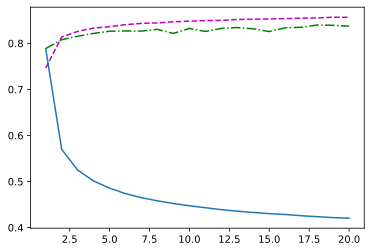

预测：在测试集合上预测一次标签：
```python
def predict_ch3(net, test_iter, n=6):
    """预测标签"""
    for X, y in test_iter:
    	break
    trues = d2l.get_fashion_mnist_labels(y)
    preds = d2l.get_fashion_mnist_labels(net(X).argmax(axis=1))
    titles = [true +'n' + pred for true, pred in zip(trues, preds)]
    d2l.show_images(
    	X[0:n].reshape((n, 28, 28)), 1, n, titles=titles[0:n]
    )
    
predict_ch3(net, test_iter)
```
结果如下：
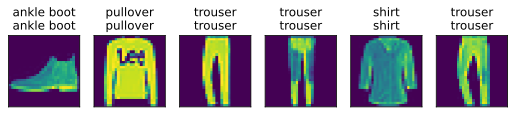

### 使用pytorch

```python
batch_size = 256
train_iter, test_iter = d2l.load_data_fashion_mnist(batch_size)

# pytorch 不会自动将二维张量转成一维张量，因此我们需要手动将其展平
# 这里我们使用 nn.Flatten 层来实现这一操作
net = nn.Sequential(nn.Flatten(), nn.Linear(784, 10))
def init_weights(m):
    if type(m) == nn.Linear:
    # 均值默认是0
    	nn.init.normal_(m.weight, std=0.01)
net.apply(init_weights)
loss = nn.CrossEntropyLoss()
trainer = torch.optim.SGD(net.parameters(), lr=0.1)

num_epochs = 10
# d2l.train_ch3(net, train_iter, test_iter, loss, num_epochs, trainer)
train_ch3(net, train_iter, test_iter, loss, num_epochs, trainer)
```
## 感知机（Perceptron）

### 基本概念

**感知机**是**最简单的神经网络模型**，由 Frank Rosenblatt 在 1957 年提出。它是**二分类**的线性分类模型，是神经网络和支持向量机的基础。

#### 核心思想：

* 模仿生物神经元的工作原理

* 接受多个输入，产生一个输出

* 能够学习简单的线性决策边界

### 数学模型

#### 基本结构

一个感知机包含：

1. **输入层**：接收特征向量

2. **权重和偏置**：可学习参数

3. **激活函数**：阶跃函数（Step Function）

4. **输出层**：二分类结果

#### 数学公式

对于一个输入向量 $\mathbf{x} = [x_1, x_2, ..., x_n]$：

**加权和**：
$z=∑_{i=1}^n ​w_i ​x_i + b=w^Tx+b$

**激活函数（阶跃函数）**：

$f(z)=\begin{cases} 1 & if z >0 \\ 0 & otherwise \end{cases}​$

或使用符号函数：

$f(z)=sign(z)=\begin{cases} +1 & if z>0 \\ -1 & otherwise\end{cases}​$

### 几何解释

感知机实际上是在特征空间中寻找一个**超平面**：
$w^Tx+b=0$

* **权重向量 $\mathbf{w}$**：决定超平面的方向

* **偏置 $b$**：决定超平面的位置（偏移）

#### 分类规则：

* 如果 $\mathbf{w}^T \mathbf{x} + b > 0$，预测为正类（+1）

* 如果 $\mathbf{w}^T \mathbf{x} + b < 0$，预测为负类（-1）

## 多层感知机

### 基本概念

**多层感知机**（Multilayer Perceptron, MLP）是**单层感知机的扩展**，通过引入**隐藏层**和**非线性激活函数**，使其能够学习复杂的非线性模式。

## 网络结构

### 标准架构

```text
输入层 → 隐藏层1 → 隐藏层2 → ... → 隐藏层n → 输出层
     (n个神经元)    (m个神经元)            (k个神经元)
```

### 数学表示

对于一个 **L 层 MLP**：

**前向传播**：

1. 输入层：$\mathbf{h}^{(0)} = \mathbf{x}$

2. 隐藏层 $l$：$\mathbf{z}^{(l)} = \mathbf{W}^{(l)}\mathbf{h}^{(l-1)} + \mathbf{b}^{(l)}$

3. 激活层：$\mathbf{h}^{(l)} = \sigma(\mathbf{z}^{(l)})$

4. 输出层：$\mathbf{y} = \text{softmax}(\mathbf{z}^{(L)})$（对于分类）

### 激活函数

激活函数引入**非线性**，是 MLP 的核心。

```python
# 1. Sigmoid（早期常用）
sigmoid = nn.Sigmoid()
# 公式：σ(x) = 1 / (1 + e^{-x})
# 问题：梯度消失、计算慢

# 2. Tanh
tanh = nn.Tanh()
# 公式：tanh(x) = (e^x - e^{-x}) / (e^x + e^{-x})
# 输出范围：[-1, 1]，零中心化

# 3. ReLU（最常用）
relu = nn.ReLU()
# 公式：ReLU(x) = max(0, x)
# 优点：计算快、缓解梯度消失

# 4. Leaky ReLU
leaky_relu = nn.LeakyReLU(0.01)
# 公式：f(x) = x if x>0 else αx
# 解决"神经元死亡"问题

# 5. Softmax（输出层）
softmax = nn.Softmax(dim=1)
# 用于多分类，输出概率分布
```

### 代码实现

```python
net = nn.Sequential(
    nn.Flatten(), # flatten input
    nn.Linear(784, 256), # input layer
    nn.ReLU(), # hidden layer
    nn.Linear(256, 10) # output layer
)

def init_weights(m):
    if type(m) == nn.Linear:
    	nn.init.normal_(m.weight, std=0.01)
        
net.apply(init_weights)

batch_size = 256
lr = 0.1
num_epochs = 10

loss = nn.CrossEntropyLoss()
trainer = torch.optim.SGD(net.parameters(), lr=lr)

train_iter, test_iter = d2l.load_data_fashion_mnist(batch_size)

train_ch3(net, train_iter, test_iter, loss, num_epochs, trainer)
```

结果如下：

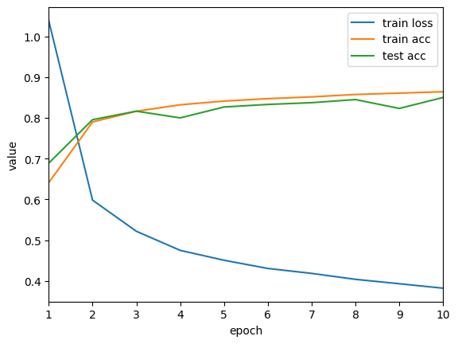

## 模型选择

### 误差

1. 训练误差：模型在训练数据上的误差
2. 泛化误差：模型在新数据上的误差

### 数据集

1. 训练数据集
2. 验证数据集

#### K折交叉验证

将数据集划分为 **K 个大小大致相等、互不重叠的子集（fold）**，每次选取其中 **1 个作为验证集，其余 K−1 个作为训练集**，重复 K 次，最终对性能指标取平均。

### 过拟合和欠拟合

| 维度        | 欠拟合     | 过拟合     |
| --------- | ------- | ------- |
| 训练误差      | 高       | 低       |
| 验证 / 测试误差 | 高       | 高       |
| 泛化间隙      | 小（但整体差） | 大       |
| 学习曲线      | 早早停滞    | 后期分叉    |
| 偏差–方差     | 高偏差、低方差 | 低偏差、高方差 |

### 模型复杂度

参数个数，参数取值范围

### VC维

最大数据集容量：
单层感知机：VC维 = 3

### 权重衰退

使用均方范数，解决过拟合

一般来说$\eta * \lambda < 1$

### 丢弃法

在隐藏全连接层增加噪音，并且希望$E(x')= x$，对每个元素施加如下噪音：

$x'_i = \begin{cases} 0 & with\ probablity\ p \\ \frac{x_i}{1-p} & otherwise \end{cases}$

丢弃法相当于训练时的正则项，影响模型参数的更新；

在推理过程中，丢弃法直接返回输入

### 数值稳定性

梯度爆炸和梯度消失

* **梯度消失（Vanishing Gradient）**
  在反向传播时，梯度在多层网络中逐层相乘而不断减小，导致靠近输入层的参数几乎得不到有效更新，模型学习停滞或收敛极慢。

* **梯度爆炸（Exploding Gradient）**
  与之相反，梯度在传播过程中指数式放大，造成权重更新幅度过大，训练过程发散或出现数值溢出。

#### 模型初始化

将每一层的输出和梯度都看作随机变量 ,让每一层的方差是一个常数

1. 在合理的区间随机初始参数：训练开始容易有数值不稳定
2. Xavier初始：$n_{t-1} * \gamma_t = 1$，$n_t * \gamma_t=1$，但是如上两个条件很难全部满足，因此：
    $\gamma_t(n_{t-1}+n_t)/2 =1\rightarrow \gamma_t=2/(n_{t-1}+n_t)$
    正态分布：$\mathcal{N}(0,sqrt{2/(n_{t-1}+n_t)}$
    均匀分布：$\mathcal{U}(-\sqrt{6/(n_{t-1}+n_t)}, \sqrt{6/(n_{t-1}+n_t)})$，分布$\mathcal{U}[-a,a]$和方差为$\frac{a^2}{3}$
3. 适配权重形状变换，特别是$n_t$

## 神经网络

### 层和块

### 参数管理

### 卷积

处理图像的三通道信息，需要的神经元极多。

1. 平移不变性：二维卷积，全连接层的限制，抹去一些维度。
2. 局部性：评估输出时，不应选择远离输入的参数

对全连接层使用平移不变性和局部性得到卷积层。

卷积层将输入和核矩阵进行交叉相关，加上偏移后得到输出；核矩阵和偏移是可以学习的参数；核矩阵的大小是超参数。

填充和步幅是卷积层的超参数，填充是在周围添加一些额外的行列，控制输出的形状。

步幅是每次滑动窗口时的行列的步长，可以成倍减少输出的形状。

填充一般为：$p_h = k_h -1$，$p_w = k_w -1$；但是当核为奇数，上下两侧填充$\frac{p_h}{2}$，当核为偶数时，上侧$\lceil\frac{p_h}{2}\rceil$，下侧$\lfloor\frac{p_h}{2}\rfloor$

输入的高度和宽度都可以被步幅$s_h, s_w$整除，则输出大小为：
$(n_h\div s_h)\times(n_w\div s_w)$

### 卷积的相关代码实现

#### 自定义层和块

一般的一个nn模型使用Sequential构造：

```python
net = nn.Sequential(
    nn.Linear(20, 256),
    nn.ReLU(),
    nn.Linear(256, 10)
)
```

手动实现上述模型如下：

```python
class MLP(nn.Module):
    def __init__(self):
        super().__init__()
        self.hidden = nn.Linear(20, 256)
        self.out = nn.Linear(256, 10)

    def forward(self, X):
    	return self.out(F.relu(self.hidden(X)))

net = MLP()

class MySequential(nn.Module):
    def __init__(self, *args):
    	super().__init__()
    	for block in args:
    		self._modules[block] = block
    
    def forward(self, X):
    	for block in self._modules.values():
    		X = block(X)
    	return X

net = MySequential(
    nn.Linear(20, 256),
    nn.ReLU(),
    nn.Linear(256, 10)
)
```

在自己实现的MLP中手动加入一个隐藏层

```python
class FixedHiddenMLP(nn.Module):
    def __init__(self):
        super().__init__()
        self.rand_weight = torch.rand((20, 20), requires_grad=False)
        self.linear = nn.Linear(20, 20)
    
    def forward(self, X):
        X = self.linear(X)
        X = F.relu(torch.matmul(X, self.rand_weight) + 1)
        X = self.linear(X)
        while X.abs().sum() > 1:
        	X /= 2
        return X.sum()
net = FixedHiddenMLP()
```

合并后简洁实现：

```python
class NestedMLP(nn.Module):
def __init__(self):
    super().__init__()
    self.net = nn.Sequential(
        nn.Linear(20, 64),
        nn.ReLU(),
        nn.Linear(64, 32),
        nn.ReLU()
    )
    self.out = nn.Linear(32, 16)

def forward(self, X):
	return self.out(self.net(X))
    
chimera = nn.Sequential(
    NestedMLP(),
    nn.Linear(16, 20),
    FixedHiddenMLP()
)


print(chimera(X))
# tensor(0.3952, grad_fn=<SumBackward0>)
```
#### 参数管理

考虑在有module的情况下访问或者管理参数。

首先考虑一个单隐藏层MLP：

```python
net = nn.Sequential(
    nn.Linear(4,8),
    nn.ReLU(),
    nn.Linear(8,1)
)
```

获取其中一层的所有参数：

```python
print(net[2].state_dict()) # 访问第二层的参数
# OrderedDict([('weight', tensor([[ 0.1968, 0.2480, 0.3306, 0.1889, -0.2792, 0.0940, 0.2401, 0.1442]])), ('bias', tensor([0.0610]))])
```

获取某一层的偏置参数：

```python
# 访问第二层的偏置参数
print(type(net[2].bias))
print(net[2].bias)
print(net[2].bias.data)

# <class 'torch.nn.parameter.Parameter'> 
# Parameter containing: 
# tensor([0.0610], requires_grad=True) 
# tensor([0.0610])
```

权重的梯度在反向传播前为空：

```python
print(net[2].weight.grad == None)

# True
```

一次性访问所有参数：

```python
print(*[(name, param.shape) for name, param in net[0].named_parameters()])

print(*[(name, param.shape) for name, param in net.named_parameters()])


# ('weight', torch.Size([8, 4])) ('bias', torch.Size([8])) 
# ('0.weight', torch.Size([8, 4])) ('0.bias', torch.Size([8])) ('2.weight', torch.Size([1, 8])) ('2.bias', torch.Size([1]))
```

直接访问命名参数：

```python
net.state_dict()['2.bias'].data

# tensor([0.0610])
```

可以直接打印网络结构，首先定义一个网络如下：

```python
def block1():
    return nn.Sequential(
        nn.Linear(4,8),
        nn.ReLU(),
        nn.Linear(8,4),
        nn.ReLU()
    )

def block2():
    net = nn.Sequential()
    for i in range(4):
    	net.add_module(f'block {i}', block1())
    return net

rgnet = nn.Sequential(
    block2(),
    nn.Linear(4,1)
)
```

打印网络的结构：

```python
print(rgnet)
```

网络的结构显示如下：

```python
Sequential(
  (0): Sequential(
    (block 0): Sequential(
      (0): Linear(in_features=4, out_features=8, bias=True)
      (1): ReLU()
      (2): Linear(in_features=8, out_features=4, bias=True)
      (3): ReLU()
    )
    (block 1): Sequential(
      (0): Linear(in_features=4, out_features=8, bias=True)
      (1): ReLU()
      (2): Linear(in_features=8, out_features=4, bias=True)
      (3): ReLU()
    )
    (block 2): Sequential(
      (0): Linear(in_features=4, out_features=8, bias=True)
      (1): ReLU()
      (2): Linear(in_features=8, out_features=4, bias=True)
      (3): ReLU()
    )
    (block 3): Sequential(
      (0): Linear(in_features=4, out_features=8, bias=True)
      (1): ReLU()
      (2): Linear(in_features=8, out_features=4, bias=True)
      (3): ReLU()
    )
  )
  (1): Linear(in_features=4, out_features=1, bias=True)
)
```

修改默认的初始参数：

```python
def init_normal(m):
    if type(m) == nn.Linear:
        nn.init.normal_(m.weight, mean=0, std=0.01)
        nn.init.zeros_(m.bias)
        
net.apply(init_normal)
print(net[0].weight.data[0])  # 查看第一层的权重参数
print(net[0].bias.data)      # 查看第一层的偏置参数

# tensor([-0.0051, -0.0083,  0.0073, -0.0136])
# tensor([0., 0., 0., 0., 0., 0., 0., 0.])
```

使用xavier初始化参数：

```python
def xavier(m):
    if type(m) == nn.Linear:
        nn.init.xavier_uniform_(m.weight)
        
def init_42(m):
    if type(m) == nn.Linear:
        nn.init.constant_(m.weight, 42)

net[0].apply(xavier)
net[2].apply(init_42)
print(net[0].weight.data[0])  # 查看第一层的权重参数
print(net[2].weight.data)      # 查看第二层的权重参数

# tensor([ 0.1444, -0.5032,  0.3079, -0.4662])
# tensor([[42., 42., 42., 42., 42., 42., 42., 42.]])
```

自定义初始化函数：

```python
def my_init(m):
    if type(m) == nn.Linear:
        print("Init", *[(name, param.shape) for name, param in m.named_parameters()])
        nn.init.uniform_(m.weight, -10, 10)
        m.weight.data *= m.weight.data.abs() >= 5
        
net.apply(my_init)
print(net[0].weight.data)  # 查看第一层的权重参数
```

输出结果如下：

```python
Init ('weight', torch.Size([8, 4])) ('bias', torch.Size([8]))
Init ('weight', torch.Size([1, 8])) ('bias', torch.Size([1]))
tensor([[ 0.0000, -0.0000,  0.0000, -0.0000],
        [-0.0000,  0.0000, -0.0000, -0.0000],
        [ 0.0000,  0.0000,  0.0000, -0.0000],
        [ 9.0355,  0.0000, -0.0000, -8.7955],
        [ 9.7313, -8.7391,  5.5579,  0.0000],
        [-5.8401,  0.0000, -9.5707, -0.0000],
        [-9.2654,  6.4986, -8.7337,  5.2166],
        [-5.4260, -8.8009,  0.0000,  0.0000]])
```

可以使用一种简单粗暴的手段初始化：

```python
net[0].weight.data[:] += 1.0
net[0].weight.data[0, 0] = 42
print(net[0].weight.data[0])

# tensor([42.,  2.,  2.,  2.])
```

参数绑定，也就是多个层共享一些参数：

```python
shared = nn.Linear(8,8)
net = nn.Sequential(
    nn.Linear(4,8),
    nn.ReLU(),
    shared,
    nn.ReLU(),
    shared,
    nn.ReLU(),
    nn.Linear(8,1)
)

net(X)
print(net[2].weight.data[0] == net[4].weight.data[0])  # True
net[2].weight.data[0,0] = 100
print(net[2].weight.data[0] == net[4].weight.data[0])  # True
```

也可以自定义一个无参数的层：

```python
# 自定义一个无参数的层
class CenteredLayer(nn.Module):
    def __init__(self):
        super().__init__()
    def forward(self, X):
        return X - X.mean()
    
layer = CenteredLayer()
print(layer(torch.FloatTensor([1,2,3,4,5])))  # tensor([-2., -1., 0., 1., 2.])

net = nn.Sequential(
    nn.Linear(8,128),
    CenteredLayer()
)
Y = net(torch.rand(4,8))
print(Y.mean())  # tensor(-7.4506e-09, grad_fn=<MeanBackward0>)
```

定义一个有参数的层：

```python
# 自定义一个有参数的层
class MyLinear(nn.Module):
    def __init__(self, in_features, out_features):
        super().__init__()
        self.weight = nn.Parameter(torch.randn(in_features, out_features))
        self.bias = nn.Parameter(torch.randn(out_features,))
        # self.weight = nn.Parameter(torch.zeros(in_features, out_features))
        # self.bias = nn.Parameter(torch.zeros(out_features,))
    def forward(self, X):
        linear = torch.matmul(X, self.weight.data) + self.bias.data
        return F.relu(linear)
    
dense = MyLinear(5,3)
print(dense.weight)
```

使用自定义的层执行正向传播计算：

```python
print(dense(torch.rand(2,5)))

# tensor([[0.7151, 1.4433, 0.0000],
#         [1.3851, 2.3780, 0.0000]])
```

#### 卷积的多输入和多输出

二维卷积的多输入多输出的不同组合：

```python
def corr2d_multi_in(X, K):
    return sum(d2l.corr2d(x, k) for x, k in zip(X, K))

def corr2d_multi_in_out(X, K):
    return torch.stack([corr2d_multi_in(X, k) for k in K], 0)
```

1x1卷积，即全连接层，进行验证：

```python
# 1X1 卷积
def corr2d_multi_in_out_1x1(X, K):
    c_i, h, w = X.shape
    c_o = K.shape[0]
    X = X.reshape((c_i, h * w))
    K = K.reshape((c_o, c_i))
    Y = torch.matmul(K, X)
    return Y.reshape((c_o, h, w))


X = torch.normal(0, 1, (3, 3, 3))
K = torch.normal(0, 1, (2, 3, 1, 1))

Y1 = corr2d_multi_in_out_1x1(X, K)
Y2 = corr2d_multi_in_out(X, K)

assert float(torch.abs(Y1 - Y2).sum()) < 1e-6
```

#### 卷积

手动定义一个二维卷积函数：

```python
def corr2d(X, K):
    """Compute 2D cross-correlation."""
    h, w = K.shape
    Y = torch.zeros((X.shape[0] - h + 1, X.shape[1] - w + 1))
    for i in range(Y.shape[0]):
        for j in range(Y.shape[1]):
            Y[i, j] = (X[i:i + h, j:j + w] * K).sum()
    return Y
```

定义一个二维卷积块：

```python
class conv2d(nn.Module):
    def __init__(self, kernel_size):
        super().__init__()
        self.weight = nn.Parameter(torch.rand(kernel_size))
        self.bias = nn.Parameter(torch.zeros(1))

    def forward(self, x):
        return corr2d(x, self.weight) + self.bias
```

简单使用这个二维卷积做训练：

```python
conv2d = nn.Conv2d(1, 1, kernel_size=(1, 2), bias=False)
X = X.reshape((1, 1, 6, 8))
Y = Y.reshape((1, 1, 6, 7))

for i in range(10):
    Y_hat = conv2d(X)
    l = (Y_hat - Y)**2
    conv2d.zero_grad()
    l.sum().backward()
    # 手写实现SGD
    # 访问权重参数的梯度，使用学习率3e-2更新权重参数
    conv2d.weight.data[:] -= 3e-2 * conv2d.weight.grad.data
    if (i + 1) % 2 == 0:
        print(f'epoch {i + 1}, loss {l.sum():.3f}')
```

输出如下：

```python
epoch 2, loss 1.719
epoch 4, loss 0.304
epoch 6, loss 0.057
epoch 8, loss 0.012
epoch 10, loss 0.003
```

#### 卷积的填充和步幅

使用pytorch的Conv2d参数调整：

```python
conv2d = nn.Conv2d(1, 1, kernel_size=3, padding=1)
```

### 池化

池化层类似卷积，但是执行的操作不再是交叉相关操作；池化曾返回窗口中最大或者平均值。

池化可以缓解卷积层对于位置信息的敏感性，且且同样有窗口大小、填充和步幅作为超参数。

#### 代码实现

手动实现一个正向传播二维池化：

```python
# 正向传播实现二维池化层
def pool2d(X, pool_size, mode='max'):
    p_h, p_w = pool_size
    Y = torch.zeros((X.shape[0] - p_h + 1, X.shape[1] - p_w + 1))
    for i in range(Y.shape[0]):
        for j in range(Y.shape[1]):
            if mode == 'max':
                Y[i, j] = torch.max(X[i:i + p_h, j:j + p_w])
            elif mode == 'avg':
                Y[i, j] = torch.mean(X[i:i + p_h, j:j + p_w])
    return Y
```

使用pytorch的函数：

1. max池化：`pool2d = nn.MaxPool2d(3, stride=2, padding=1)`
2. avg池化： `pool2d = nn.AvgPool2d(3, stride=2, padding=1)`

### LeNet

实现LeNet,并在Fashion Mnist上训练测试：
（使用Lazy*函数避免手动计算输出输出维度）

```python
class Reshape(torch.nn.Module):
    def forward(self, x):
        return x.view(-1, 1, 28, 28)

net = nn.Sequential(
    Reshape(),
    nn.Conv2d(1, 6, kernel_size=5, padding=2), nn.ReLU(),  # nn.Sigmoid()改为ReLU以改善梯度流动，避免Sigmoid的梯度消失问题
    # nn.AvgPool2d(kernel_size=2, stride=2),
    nn.MaxPool2d(kernel_size=2, stride=2),
    nn.Conv2d(6, 16, kernel_size=5), nn.ReLU(),  # 同样改为ReLU
    # nn.AvgPool2d(kernel_size=2, stride=2),
    nn.MaxPool2d(kernel_size=2, stride=2),
    nn.Flatten(),
    # nn.Linear(16 * 5 * 5, 120), nn.Sigmoid(),
    nn.LazyLinear(120), nn.ReLU(),  # 改为ReLU
    nn.Linear(120, 84), nn.ReLU(),  # 改为ReLU
    nn.Linear(84, 10)
)

batch_size = 256
train_iter, test_iter = d2l.load_data_fashion_mnist(batch_size)

def evaluate_accuracy(net, data_iter, device = None):
    """使用GPU计算模型在数据集上的精度"""
    if isinstance(net, torch.nn.Module):
        net.eval()  # 将模型设置为评估模式
        if not device:
            device = next(iter(net.parameters())).device
    metric = d2l.Accumulator(2)  # 正确预测数、预测总数
    for X, y in data_iter:
        if isinstance(X, list):
            # BERT微调所需（之后将介绍）
            X = [x.to(device) for x in X]
        else:
            X = X.to(device)
        y = y.to(device)
        metric.add(d2l.accuracy(net(X), y), y.numel())
        
    return metric[0] / metric[1]

def train_ch6(net, train_iter, test_iter, num_epochs, lr, device):
    """用GPU训练模型（在第6章中将介绍）"""
    def init_weights(m):
        if type(m) == nn.Linear or type(m) == nn.Conv2d:
            nn.init.xavier_uniform_(m.weight)
    
    net.apply(init_weights)
    print('training on', device)
    net.to(device)
    optimizer = torch.optim.SGD(net.parameters(), lr=lr)
    loss = nn.CrossEntropyLoss()
    animator = d2l.Animator(xlabel='epoch', xlim=[1, num_epochs],
                            legend=['train loss', 'train acc', 'test acc'])
    timer = d2l.Timer()
    num_batches = len(train_iter)
    for epoch in range(num_epochs):
        # 训练损失总和、训练准确率总和、样本数
        metric = d2l.Accumulator(3)
        net.train()
        for i, (X, y) in enumerate(train_iter):
            timer.start()
            optimizer.zero_grad()
            X, y = X.to(device), y.to(device)
            y_hat = net(X)
            l = loss(y_hat, y)
            l.backward()
            optimizer.step()
            metric.add(l * X.shape[0], d2l.accuracy(y_hat, y), X.shape[0])
            timer.stop()
            train_l = metric[0] / metric[2]
            train_acc = metric[1] / metric[2]
            if( i+1) % (num_batches // 5) == 0 or i == num_batches - 1:
                animator.add(epoch + (i + 1) / num_batches,
                             (train_l, train_acc, None))
        test_acc = evaluate_accuracy(net, test_iter)
        animator.add(epoch + 1, (None, None, test_acc))
    print(f'loss {train_l:.6f}, train acc {train_acc:.6f}, '
          f'test acc {test_acc:.6f}')
    print(f'{metric[2] * num_epochs / timer.sum():.1f} examples/sec on {str(device)}')

lr, num_epochs = 0.05, 20 # 低学习率适配ReLU, 增加epoch以获得更好收敛

train_ch6(net, train_iter, test_iter, num_epochs, lr, d2l.try_gpu())

```

训练结果如下：

```python
loss 0.276554, train acc 0.898100, test acc 0.870700 
143448.7 examples/sec on cuda:0
```

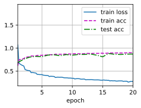

### AlexNet

相比LeNet, 将卷积层增加到5层，全连接层增加到3层。

具体代码如下：

首先定义这个网络：

```python
import torch
from torch import nn
from d2l import torch as d2l

net = nn.Sequential(
    nn.Conv2d(1, 96, kernel_size=11, stride=4, padding=1),
    nn.ReLU(),
    nn.MaxPool2d(kernel_size=3, stride=2),
    nn.Conv2d(96, 256, kernel_size=5, padding=2), 
    nn.ReLU(),
    nn.MaxPool2d(kernel_size=3, stride=2),
    nn.Conv2d(256, 384, kernel_size=3, padding=1), 
    nn.ReLU(),
    nn.Conv2d(384, 384, kernel_size=3, padding=1), 
    nn.ReLU(),
    # nn.Conv2d(384, 256, kernel_size=3, padding=1), 
    nn.Conv2d(384, 384, kernel_size=3, padding=1),
    nn.ReLU(),
    nn.MaxPool2d(kernel_size=3, stride=2),
    nn.Flatten(),
    # nn.Linear(6400, 4096), nn.ReLU(), nn.Dropout(p=0.5),
    nn.LazyLinear(4096), nn.ReLU(), nn.Dropout(p=0.5),
    nn.Linear(4096, 4096), nn.ReLU(), nn.Dropout(p=0.5),
    nn.Linear(4096, 10)
)
```

定义batch size和学习参数，然后训练：

```python
batch_size = 128
train_iter, test_iter = d2l.load_data_fashion_mnist(batch_size, resize=224)

lr, num_epochs = 0.01, 10
d2l.train_ch6(net, train_iter, test_iter, num_epochs=num_epochs, lr=lr, device=d2l.try_gpu())
```

不做调参，简单训练结果如下：

```python
loss 0.330, train acc 0.881, test acc 0.882 
3358.1 examples/sec on cuda:0
```

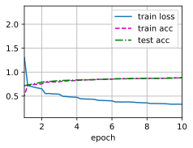

### VGG

AlexNet使用较大的卷积层，消耗很高。分VGG块，3x3卷积，n层，m通道，2x2最大池化层。

代码如下：

首先定义VGG块：

```python
import torch
from torch import nn
from d2l import torch as d2l

def vgg_block(num_convs, in_channels, out_channels):
    blk = []
    for _ in range(num_convs):
        blk.append(nn.Conv2d(in_channels, out_channels, kernel_size=3, padding=1))
        blk.append(nn.ReLU())
        in_channels = out_channels
    blk.append(nn.MaxPool2d(kernel_size=2, stride=2))
    return nn.Sequential(*blk)
```

定义经典的网络结构：

```python
conv_arch = ((1, 64), (1, 128), (2, 256), (2, 512), (2, 512))
```

定义网络：

```python
def vgg(conv_arch):
    conv_blks = []
    in_channels = 1
    for (num_convs, out_channels) in conv_arch:
        conv_blks.append(vgg_block(num_convs, in_channels, out_channels))
        in_channels = out_channels
    
    return nn.Sequential(
        *conv_blks,
        nn.Flatten(),
        nn.Linear(out_channels * 7 * 7, 4096),
        nn.ReLU(),
        nn.Dropout(0.5),
        nn.Linear(4096, 4096),
        nn.ReLU(),
        nn.Dropout(0.5),
        nn.Linear(4096, 10)
    )

net = vgg(conv_arch)
```

为了方便训练，缩小网络结构：

```python
ratio = 4
small_conv_arch = [(pair[0], pair[1] // ratio) for pair in conv_arch]
net = vgg(small_conv_arch)
```

定义训练参数，开始训练：

```python
lr, num_epochs, batch_size = 0.05, 10, 128
train_iter, test_iter = d2l.load_data_fashion_mnist(batch_size, resize=224)
d2l.train_ch6(net, train_iter, test_iter, num_epochs=num_epochs, lr=lr, device=d2l.try_gpu())
```

训练较慢，3080花费5m43s，训练结果如下：

```python
loss 0.170, train acc 0.937, test acc 0.919
1985.9 examples/sec on cuda:0
```

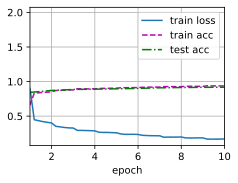

### NiN

卷积层需要的参数比较少，但是卷积层后的第一个全连接层所需的参数极其庞大，LeNet：48k, AlexNet：26M, VGG：102M.

NiN块：一个卷积层后跟两个全连接层。步幅1, 无填充，全连接层为1x1卷积。

NiN无全连接层，交替使用NiN块和步幅为2的最大池化，逐步减小高宽和增大通道数。最后使用全局平均池化得到输出，其输入通道数是类别数。

代码实现如下：

```python
import torch
from torch import nn
from d2l import torch as d2l

def nin_block(in_channels, out_channels, kernel_size, stride, padding):
    return nn.Sequential(
        nn.Conv2d(in_channels, out_channels, kernel_size, stride, padding),
        nn.ReLU(),
        nn.Conv2d(out_channels, out_channels, kernel_size=1),
        nn.ReLU(),
        nn.Conv2d(out_channels, out_channels, kernel_size=1),
        nn.ReLU()
    )

net = nn.Sequential(
    nin_block(1, 96, kernel_size=11, stride=4, padding=0),
    nn.MaxPool2d(kernel_size=3, stride=2),
    nin_block(96, 256, kernel_size=5, stride=1, padding=2),
    nn.MaxPool2d(kernel_size=3, stride=2),
    nin_block(256, 384, kernel_size=3, stride=1, padding=1),
    nn.MaxPool2d(kernel_size=3, stride=2),
    nn.Dropout(0.5),
    nin_block(384, 10, kernel_size=3, stride=1, padding=1),
    nn.AdaptiveAvgPool2d((1, 1)),
    nn.Flatten()
)

lr, num_epochs = 0.05, 10
batch_size = 128
train_iter, test_iter = d2l.load_data_fashion_mnist(batch_size, resize=224)
d2l.train_ch6(net, train_iter, test_iter, num_epochs=num_epochs, lr=lr, device=d2l.try_gpu())
```

训练结果如下：

```python
loss 0.355, train acc 0.870, test acc 0.856
2681.8 examples/sec on cuda:0
```

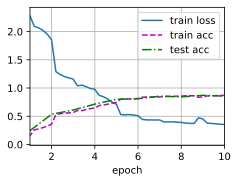

### GoogLeNet

Inception块：四个路径从不同层面抽取信息，然后在输出通道维合并。

1. 1 Conv
2. 1 Conv + 3 Conv,pad 1
3. 1 Conv + 5 Conv,pad 2
4. 3 MaxPool, pad1 + 1 Conv

跟单3x3或者5x5卷积相比，Inception具有更少的参数个数和计算复杂度。

InceptionV3：

1. 将stage3的5 Conv改为两个3 Conv
2. 将stage4的3 Conv改为一个1x7 Conv和一个7x1 Conv；再将5 Conv改为两组，每组一个1x7 Conv和一个7x1 Conv
3. 将stage5的3 Conv改为并行的两个，3x1 Conv和1x3 Conv；将5 Conv改为一个3 Conv后接两个并行的3x1 Conv和1x3 Conv。

V1原始版本的实现如下，首先定义Inception块：

```python
import torch
from torch import nn
from torch.nn import functional as F
from d2l import torch as d2l

class Inception(nn.Module):
    def __init__(self, in_channels, c1, c2, c3, c4, **kwargs):
        super(Inception, self).__init__(**kwargs)
        # 1x1 conv branch
        self.p1_1 = nn.Conv2d(in_channels, c1, kernel_size=1)
        # 1x1 conv -> 3x3 conv branch
        self.p2_1 = nn.Conv2d(in_channels, c2[0], kernel_size=1)
        self.p2_2 = nn.Conv2d(c2[0], c2[1], kernel_size=3, padding=1)
        # 1x1 conv -> 5x5 conv branch
        self.p3_1 = nn.Conv2d(in_channels, c3[0], kernel_size=1)
        self.p3_2 = nn.Conv2d(c3[0], c3[1], kernel_size=5, padding=2)
        # 3x3 max pooling -> 1x1 conv branch
        self.p4_1 = nn.MaxPool2d(kernel_size=3, stride=1, padding=1)
        self.p4_2 = nn.Conv2d(in_channels, c4, kernel_size=1)

    def forward(self, x):
        p1 = F.relu(self.p1_1(x))
        p2 = F.relu(self.p2_2(F.relu(self.p2_1(x))))
        p3 = F.relu(self.p3_2(F.relu(self.p3_1(x))))
        p4 = F.relu(self.p4_2(self.p4_1(x)))
        return torch.cat((p1, p2, p3, p4), dim=1)
```

上述块照抄即可，定义每一个stage如下：

```python
b1 = nn.Sequential(
    nn.Conv2d(1, 64, kernel_size=7, stride=2, padding=3),
    nn.ReLU(),
    nn.MaxPool2d(kernel_size=3, stride=2, padding=1)
)
b2 = nn.Sequential(
    nn.Conv2d(64, 64, kernel_size=1),
    nn.ReLU(),
    nn.Conv2d(64, 192, kernel_size=3, padding=1),
    nn.ReLU(),
    nn.MaxPool2d(kernel_size=3, stride=2, padding=1)
)
b3 = nn.Sequential(
    Inception(192, 64, (96, 128), (16, 32), 32),
    Inception(256, 128, (128, 192), (32, 96), 64),
    nn.MaxPool2d(kernel_size=3, stride=2, padding=1)
)
b4 = nn.Sequential(
    Inception(480, 192, (96, 208), (16, 48), 64),
    Inception(512, 160, (112, 224), (24, 64), 64),
    Inception(512, 128, (128, 256), (24, 64), 64),
    Inception(512, 112, (144, 288), (32, 64), 64),
    Inception(528, 256, (160, 320), (32, 128), 128),
    nn.MaxPool2d(kernel_size=3, stride=2, padding=1)
)
b5 = nn.Sequential(
    Inception(832, 256, (160, 320), (32, 128), 128),
    Inception(832, 384, (192, 384), (48, 128), 128),
    nn.AdaptiveAvgPool2d((1, 1)),
    nn.Flatten()
)

net = nn.Sequential(b1, b2, b3, b4, b5, nn.Linear(1024, 10))
```

开始训练：

```python
lr, num_epochs, batch_size = 0.1, 10, 128
train_iter, test_iter = d2l.load_data_fashion_mnist(batch_size, resize=96)
d2l.train_ch6(net, train_iter, test_iter, num_epochs, lr, d2l.try_gpu())
```

训练结果如下：

```python
loss 0.241, train acc 0.908, test acc 0.895
2919.5 examples/sec on cuda:0
```

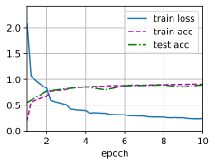

### 批量归一化

损失出现在最后，后面的层训练较快。

数据在最底部，底部的层训练较慢，底部层一变化，所有都得跟着变，最后的那些层需要重新学习很多次，导致收敛变慢。

#### 核心思想

对神经网络中每一层的输入（或输出）进行归一化，使其分布保持稳定（均值为0，方差为1），从而减少内部协变量偏移（Internal Covariate Shift，即每层输入分布因前层参数更新而不断变化的问题）。

#### 计算步骤

假设一个批次（batch）的输入为 $x\in \mathbb{R}^{B\times C}$（B 为批次大小，C 为特征维度），BN的步骤如下：

1. 计算批次均值和方差：
$\mu_B = \frac{1}{B}\sum_{i=1}^{B} x_i,\qquad \sigma_B^2 = \frac{1}{B}\sum_{i=1}^{B}(x_i - \mu_B)^2$
2. 归一化：
$\hat{x}_i = \frac{x_i - \mu_B}{\sqrt{\sigma_B^2 + \epsilon}}$其中，$\epsilon$是小常数，防止除零
3. 缩放和平移（引入可学习参数 γ 和 β ）：
$y_i = \gamma\hat{x}_i + \beta$

其中可学习的参数为$\lambda$和$\beta$，作用在全连接层和卷积层输出上，激活函数前，或者作用在全连接层和卷积层输入上；对于全连接层，作用在特征维；对于卷积层，作用在通道维。

#### 代码实现

```python
import torch
from torch import nn
from d2l import torch as d2l

# batch normalization function
# X: input tensor
# gamma: scale parameter
# beta: shift parameter
# moving_mean: running mean for inference
# moving_var: running variance for inference
# eps: small constant to avoid division by zero
# momentum: momentum for running mean/variance, used during training to update moving averages
def batch_norm(X, gamma, beta, moving_mean, moving_var, eps, momentum):
    if not torch.is_grad_enabled():
        # 推理模式：训练期间累积的滑动平均均值/方差
        X_hat = (X - moving_mean) / torch.sqrt(moving_var + eps)
    else:
        # 简单起见，我们假设输入为2D或4D张量（全连接层或卷积层的输入）
        assert len(X.shape) in (2, 4)
        # 全连接层，计算特征维度上的均值和方差
        if len(X.shape) == 2:
            # mean和var的形状与X的特征维度相同
            # dim=0表示按行计算均值和方差
            mean = X.mean(dim=0)
            var = ((X - mean) ** 2).mean(dim=0)
        else:
            # 卷积层，计算通道维度上的均值和方差
            # dim=(0,2,3)表示按批量和空间维度计算均值和方差
            # keepdim=True保持均值和方差的维度，以便后续广播运算
            mean = X.mean(dim=(0, 2, 3), keepdim=True)
            var = ((X - mean) ** 2).mean(dim=(0, 2, 3), keepdim=True)
        # 训练模式：使用当前批次的均值和方差进行归一化
        # X_hat: 用当前batch的均值和方差归一化到分布N(0,1)【标准正态分布】
        X_hat = (X - mean) / torch.sqrt(var + eps)
        # 把当前batch算出的均值和方差，按照动量累积到moving_mean和moving_var中
        moving_mean = momentum * moving_mean + (1.0 - momentum) * mean
        moving_var = momentum * moving_var + (1.0 - momentum) * var
    # BN的仿射变换
    # 由于之前的归一化把数据变成了标准正态分布N(0,1)，所以需要通过gamma和beta进行仿射变换，恢复出数据的表达能力
    Y = gamma * X_hat + beta
    return Y, moving_mean, moving_var

# Batch Normalization Layer
class BatchNorm(nn.Module):
    # num_features: number of features (output dimension of fully connected layer or number of channels in convolutional layer)
    # num_dims: dimension of input data (2 for fully connected layer, 4 for convolutional layer)
    def __init__(self, num_features, num_dims):
        super().__init__()
        # num_features: 特征数量（全连接层的输出维度或卷积层的通道数）
        # num_dims: 输入数据的维度（2表示全连接层，4表示卷积层）
        if num_dims == 2:
            shape = (1, num_features)
        else:
            shape = (1, num_features, 1, 1)
        # 可学习的缩放参数gamma和偏移参数beta
        self.gamma = nn.Parameter(torch.ones(shape))
        self.beta = nn.Parameter(torch.zeros(shape))
        # 用于推理的移动平均均值和方差，不作为模型参数参与梯度更新
        self.moving_mean = torch.zeros(shape)
        self.moving_var = torch.ones(shape)

    def forward(self, X):
        if self.moving_mean.device != X.device:
            self.moving_mean = self.moving_mean.to(X.device)
            self.moving_var = self.moving_var.to(X.device)
        # 调用batch_norm函数进行批量归一化
        Y, self.moving_mean, self.moving_var = batch_norm(
            X,
            self.gamma,
            self.beta,
            self.moving_mean,
            self.moving_var,
            # 避免除零错误的小常数, 不同框架可能使用不同的默认值
            eps=1e-5,
            momentum=0.9,
        )
        return Y

# Example: Using BatchNorm in LeNet
# 通常在卷积层后和激活函数前使用批量归一化
net = nn.Sequential(
    nn.Conv2d(1, 6, kernel_size=5),
    BatchNorm(6, num_dims=4),
    # nn.Sigmoid(),
    nn.ReLU(),
    nn.MaxPool2d(kernel_size=2, stride=2),
    nn.Conv2d(6, 16, kernel_size=5),
    BatchNorm(16, num_dims=4),
    # nn.Sigmoid(),
    nn.ReLU(),
    nn.MaxPool2d(kernel_size=2, stride=2),
    nn.Flatten(),
    nn.Linear(16 * 4 * 4, 120),
    BatchNorm(120, num_dims=2),
    # nn.Sigmoid(),
    nn.ReLU(),
    nn.Linear(120, 84),
    # 最后输出层通常不使用批量归一化，但是可以根据需要添加
    # BatchNorm(84, num_dims=2),
    # nn.Sigmoid(),
    nn.ReLU(),
    nn.Linear(84, 10),
)
```

训练结果如下：

```python
lr, num_epochs, batch_size = 0.5, 20, 256
train_iter, test_iter = d2l.load_data_fashion_mnist(batch_size)
d2l.train_ch6(net, train_iter, test_iter, num_epochs, lr, d2l.try_gpu())
```

```python
loss 0.126, train acc 0.952, test acc 0.893
83944.7 examples/sec on cuda:0
```

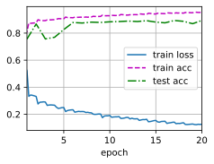

### ResNet

添加更多的神经网络的层数，不一定总是改进精度，有可能出现模型偏差。

#### 残差块

残差块（Residual Block）是 ResNet 的核心构件，它把“普通堆叠”变成“带捷径的残差学习”。

输入张量 x 从左边进来，分成两路：

1. 主径（residual path，要学的部分）
   x → W₁ → BN → ReLU → W₂ → BN → ReLU → W₃ → BN → F(x)
   注：W₁、W₂、W₃ 代表 1×1→3×3→1×1 三层卷积，合起来叫“残差函数”F(x)。
2. 捷径（shortcut path，恒等或投影）
   x ────────────→ identity / projection ───────────→
   若形状完全一致，什么参数都不加；
   若通道数或尺寸对不上，就插一个 1×1 卷积（stride=2）把 x 投影成与 F(x) 同形，记作 W_s·x。
3. 合并门（addition）
   把两路逐元素相加：y = F(x) + x（或 y = F(x) + W_s·x）。
4. 激活门（post-ReLU）
   相加结果再过一个 ReLU，得到残差块的最终输出 y，同时也作为下一块的输入。

残差块=“主径学残差，捷径保恒等，相加后激活”

#### ResNet块细节

具体设计参考VGG，具体如下：

1. 块内不变换通道：X -> 3 Conv -> BN ->ReLU -> 3 Conv -> BN -> +X -> ReLU
2. 块内变换通道(1 Conv)：X -> 3 Conv -> BN ->ReLU -> 3 Conv -> BN -> + 1 Conv(X) -> ReLU

#### 代码实现

引入相关库：

```python
import torch
from torch import nn
from torch.nn import functional as F
from d2l import torch as d2l
```

定义残差网络：

```python
class Residual(nn.Module):
    def __init__(self, input_channels, num_channels, use_1x1conv=False, strides=1):
        super().__init__()
        self.conv1 = nn.Conv2d(input_channels, num_channels, kernel_size=3,
                               padding=1, stride=strides)
        self.conv2 = nn.Conv2d(num_channels, num_channels, kernel_size=3,
                               padding=1)
        if use_1x1conv:
            self.conv3 = nn.Conv2d(input_channels, num_channels,
                                   kernel_size=1, stride=strides)
        else:
            self.conv3 = None
        self.bn1 = nn.BatchNorm2d(num_channels)
        self.bn2 = nn.BatchNorm2d(num_channels)
        self.relu = nn.ReLU(inplace=True)

    def forward(self, X):
        Y = F.relu(self.bn1(self.conv1(X)))
        Y = self.bn2(self.conv2(Y))
        if self.conv3:
            X = self.conv3(X)
        return F.relu(Y + X)
```

定义整个ResNet的5个stage：

```python
b1 = nn.Sequential(
    nn.Conv2d(1, 64, kernel_size=7, stride=2, padding=3),
    nn.BatchNorm2d(64),
    nn.ReLU(),
    nn.MaxPool2d(kernel_size=3, stride=2, padding=1),
)


def resnet_block(input_channels, num_channels, num_residuals, first_block=False):
    blk = []
    for i in range(num_residuals):
        if i == 0 and not first_block:
            blk.append(
                Residual(input_channels, num_channels, use_1x1conv=True, strides=2)
            )
        else:
            blk.append(Residual(num_channels, num_channels))
    return nn.Sequential(*blk)


b2 = nn.Sequential(*resnet_block(64, 64, 2, first_block=True))
b3 = nn.Sequential(*resnet_block(64, 128, 2))
b4 = nn.Sequential(*resnet_block(128, 256, 2))
b5 = nn.Sequential(*resnet_block(256, 512, 2))

net = nn.Sequential(
    b1,
    b2,
    b3,
    b4,
    b5,
    nn.AdaptiveAvgPool2d((1, 1)),
    nn.Flatten(),
    nn.Linear(512, 10),
)
```

开始训练：

```python
lr, num_epochs, batch_size = 0.01, 10, 256
train_iter, test_iter = d2l.load_data_fashion_mnist(batch_size, resize=224)
d2l.train_ch6(net, train_iter, test_iter, num_epochs, lr, d2l.try_gpu())
```

训练结果如下：

```python
loss 0.148, train acc 0.950, test acc 0.855
872.2 examples/sec on cuda:0
```

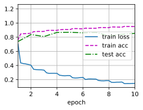

### DenseNet

DenseNet 的核心思想是对卷积神经网络中信息的流动方式进行了彻底的重新思考。

#### 核心理念

极致的连接 (Dense Connectivity)

在 DenseNet 出现之前，主流的卷积神经网络（如 VGG, ResNet）主要通过层与层之间的串联来传递信息。

* 传统 CNN: 第 $L$ 层只接收第 $L-1$ 层的输出。
* ResNet (残差网络): 通过恒等映射（Identity Shortcut），将输入与输出相加 (Add)。公式为：$x_l = H_l(x_{l-1}) + x_{l-1}$。

DenseNet 的创新点：DenseNet 提出了一种密集连接机制。在一个被称为 "Dense Block" 的模块内，每一层都与所有之前的层直接相连。这意味着，第 $l$ 层接收前面所有层 ($0, 1, ..., l-1$) 的特征图（Feature Maps）作为输入。

#### 数学公式

$$x_l = H_l([x_0, x_1, ..., x_{l-1}])$$

其中：

* $[x_0, x_1, ..., x_{l-1}]$ 表示将之前所有层的特征图在通道维度 (Channel axis) 上进行拼接 (Concatenation)。
* $H_l$ 是一个非线性变换函数（通常包含 BN + ReLU + Conv）。

#### 网络架构

DenseNet 主要由两个核心模块组成：Dense Block 和 Transition Layer。

整体架构如下：

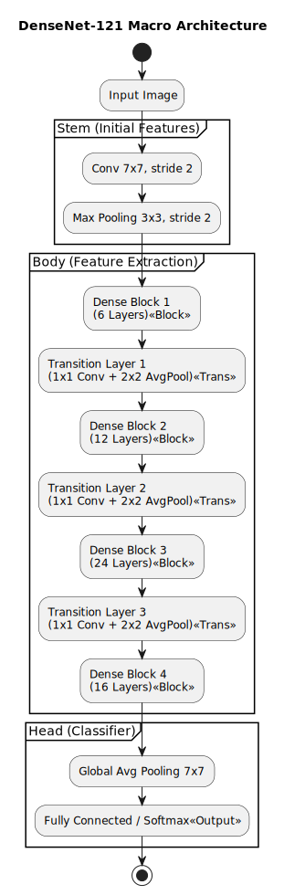

Dense Block 内部细节:

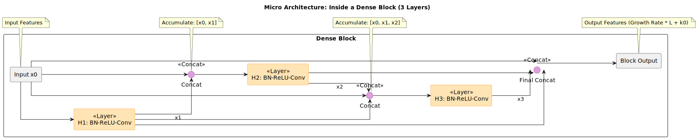

##### Dense Block (密集块)

这是网络的核心组件。在一个 Block 内部，特征图的尺寸（长和宽）保持不变，以便于进行通道拼接（Concatenation）。

* 特征重用 (Feature Reuse): 由于每一层都能“看到”之前所有的特征，网络可以更高效地利用低级特征，而不需要重复学习。
* 瓶颈层 (Bottleneck Layers): 为了减少计算量，DenseNet 通常在 $3\times3$ 卷积之前引入一个 $1\times1$ 卷积（称为 DenseNet-B）。结构通常是：`BN -> ReLU -> Conv(1x1) -> BN -> ReLU -> Conv(3x3)`。

##### Transition Layer (过渡层)

由于 CNN 需要不断缩小特征图的尺寸（Downsampling）来提取高层语义，而 Dense Block 内部保持尺寸不变，因此需要 Transition Layer 连接两个 Dense Block。

* 作用： 降低特征图的尺寸（Downsampling）和压缩通道数。
* 结构： 通常包含 `BN -> ReLU -> Conv(1x1) -> Average Pooling(2x2)`。
* 压缩系数 (Compression, $\theta$): 为了进一步减少参数，Transition Layer 会通过 $1\times1$ 卷积减少通道数。如果输入通道是 $m$，输出通道通常是 $\lfloor \theta m \rfloor$，其中 $0 < \theta \le 1$。

##### 增长率 (Growth Rate, $k$)

这是 DenseNet 特有的一个超参数。

* 如果每一层 $H_l$ 产生 $k$ 个特征图（feature maps），那么第 $l$ 层的输入通道数就是 $k_0 + k \times (l-1)$（$k_0$ 是输入层的通道数）。
* DenseNet 的一个显著特点是 $k$ 可以取得很小（例如 $k=12$ 或 $k=32$）。这被称为“窄层”（Narrow Layers）。因为网络通过拼接保留了全局状态，每一层只需要学习很少的新特征即可。

##### 代码实现

```python
import torch
from torch import nn
from d2l import torch as d2l

def conv_block(input_channels, num_channels):
    """
    卷积块函数：DenseNet的基本构建单元
    参数:
        input_channels: 输入通道数
        num_channels: 输出通道数
    返回:
        一个包含批量归一化、激活函数和卷积层的序列模块
    """
    return nn.Sequential(
        nn.BatchNorm2d(input_channels),  # 批量归一化层，对输入进行标准化，加速训练并提高稳定性
        nn.ReLU(),  # ReLU激活函数，引入非线性，将负值变为0
        nn.Conv2d(input_channels, num_channels, kernel_size=3, padding=1))  # 3x3卷积层，padding=1保持特征图尺寸不变

class DenseBlock(nn.Module):
    """
    稠密块（Dense Block）：DenseNet的核心组件
    每一层的输入都是前面所有层输出的拼接，实现特征重用
    """
    def __init__(self, num_convs, input_channels, num_channels):
        """
        初始化稠密块
        参数:
            num_convs: 该稠密块中卷积层的数量
            input_channels: 输入通道数
            num_channels: 增长率，每个卷积块新增的通道数
        """
        super(DenseBlock, self).__init__()  # 调用父类的初始化方法
        layer = []  # 创建空列表，用于存储所有卷积块
        for i in range(num_convs):  # 循环创建num_convs个卷积块
            # 计算当前卷积块的输入通道数：原始输入 + 前面i个块的输出
            # 每个块输出num_channels个通道，所以前i个块共输出 i * num_channels 个通道
            layer.append(conv_block(
                num_channels * i + input_channels, num_channels))
        self.net = nn.Sequential(*layer)  # 将所有卷积块组合成一个序列模块

    def forward(self, X):
        """
        前向传播函数
        参数:
            X: 输入张量
        返回:
            拼接了所有层输出的张量
        """
        for blk in self.net:  # 遍历稠密块中的每个卷积块
            Y = blk(X)  # 将当前输入X通过卷积块得到输出Y
            # 在通道维度（dim=1）上将输入X和输出Y拼接
            # 这是DenseNet的关键：每层的输入包含前面所有层的特征
            X = torch.cat((X, Y), dim=1)
        return X  # 返回最终拼接的特征图

# 测试稠密块的输出形状
blk = DenseBlock(2, 3, 10)  # 创建一个稠密块：2个卷积层，3个输入通道，增长率为10
X = torch.randn(4, 3, 8, 8)  # 创建随机输入张量：批量大小4，3个通道，8x8的特征图
Y = blk(X)  # 通过稠密块进行前向传播
# 输出形状应该是 (4, 3+2*10, 8, 8) = (4, 23, 8, 8)
# 因为输入3个通道 + 第1层输出10个通道 + 第2层输出10个通道 = 23个通道
print(Y.shape)  # 打印输出张量的形状
# torch.Size([4, 23, 8, 8])

def transition_block(input_channels, num_channels):
    """
    过渡层（Transition Layer）：连接两个稠密块
    作用：减少通道数和特征图尺寸，控制模型复杂度
    参数:
        input_channels: 输入通道数
        num_channels: 输出通道数（通常是输入通道数的一半）
    返回:
        包含批量归一化、激活、1x1卷积和平均池化的序列模块
    """
    return nn.Sequential(
        nn.BatchNorm2d(input_channels),  # 批量归一化
        nn.ReLU(),  # ReLU激活函数
        nn.Conv2d(input_channels, num_channels, kernel_size=1),  # 1x1卷积降低通道数
        nn.AvgPool2d(kernel_size=2, stride=2))  # 2x2平均池化，将特征图尺寸减半

# 测试过渡层的输出形状
blk = transition_block(23, 10)  # 创建过渡层：23个输入通道，10个输出通道
# Y的形状是 (4, 23, 8, 8)，经过过渡层后：
# 1x1卷积将通道数从23降到10
# 2x2平均池化将特征图从8x8降到4x4
# 最终输出形状应该是 (4, 10, 4, 4)
print(blk(Y).shape)  # 打印输出张量的形状
# torch.Size([4, 10, 4, 4])

# 构建DenseNet的第一个模块（类似于ResNet的stem）
b1 = nn.Sequential(
    # 7x7大卷积核，步幅为2，padding为3，将1通道(灰度图)转换为64通道
    # 特征图尺寸减半 (96x96 -> 48x48)
    nn.Conv2d(1, 64, kernel_size=7, stride=2, padding=3),
    nn.BatchNorm2d(64),  # 对64个通道进行批量归一化
    nn.ReLU(),  # ReLU激活函数
    # 3x3最大池化，步幅为2，padding为1
    # 特征图尺寸再次减半 (48x48 -> 24x24)
    nn.MaxPool2d(kernel_size=3, stride=2, padding=1))

# 构建DenseNet的主体部分：多个稠密块和过渡层
num_channels, growth_rate = 64, 32  # 初始通道数64，增长率32（每个卷积块新增32个通道）
num_convs_in_dense_blocks = [4, 4, 4, 4]  # 定义4个稠密块，每个块包含4个卷积层
blks = []  # 创建空列表，用于存储所有的稠密块和过渡层

for i, num_convs in enumerate(num_convs_in_dense_blocks):  # 遍历每个稠密块
    # 添加一个稠密块
    # num_convs: 当前块中的卷积层数量
    # num_channels: 当前块的输入通道数
    # growth_rate: 每层新增的通道数
    blks.append(DenseBlock(num_convs, num_channels, growth_rate))
    
    # 计算稠密块的输出通道数
    # 输出通道数 = 输入通道数 + 卷积层数 × 增长率
    num_channels += num_convs * growth_rate
    
    # 在稠密块之间添加过渡层（最后一个稠密块后不需要过渡层）
    if i != len(num_convs_in_dense_blocks) - 1:
        # 过渡层将通道数减半，控制模型复杂度
        blks.append(transition_block(num_channels, num_channels // 2))
        num_channels = num_channels // 2  # 更新通道数为减半后的值

# 构建完整的DenseNet网络
net = nn.Sequential(
    b1,  # 第一个模块：包含大卷积和最大池化
    *blks,  # 使用*解包，将列表中所有的稠密块和过渡层依次添加
    nn.BatchNorm2d(num_channels),  # 最后一个稠密块后的批量归一化
    nn.ReLU(),  # ReLU激活函数
    nn.AdaptiveAvgPool2d((1, 1)),  # 自适应平均池化，将任意大小的特征图变为1x1
    nn.Flatten(),  # 展平层，将多维张量压缩为一维向量
    nn.Linear(num_channels, 10))  # 全连接层，输出10个类别的分数（对应Fashion-MNIST的10个类别）

# 设置训练参数并开始训练
lr, num_epochs, batch_size = 0.1, 10, 256  # 学习率0.1，训练10个epoch，批量大小256
# 加载Fashion-MNIST数据集，resize=96将图像调整为96x96
train_iter, test_iter = d2l.load_data_fashion_mnist(batch_size, resize=96)
# 使用d2l提供的训练函数训练模型
# net: 网络模型
# train_iter: 训练数据迭代器
# test_iter: 测试数据迭代器
# num_epochs: 训练轮数
# lr: 学习率
# d2l.try_gpu(): 如果有GPU则使用GPU，否则使用CPU
d2l.train_ch6(net, train_iter, test_iter, num_epochs, lr, d2l.try_gpu())
```

结果如下：

```python
loss 0.140, train acc 0.949, test acc 0.896
578373.9 examples/sec on cuda:0
Best test acc: 0.896
```

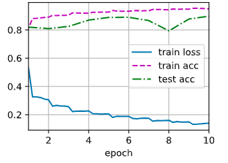

### DarkNet-53(yoloV3)

在 YOLOv3（You Only Look Once version 3）中，最为核心的改进之一就是引入了全新的特征提取网络（Backbone），命名为 Darknet-53。

#### 核心设计理念

Darknet-53 的设计主要基于以下三个关键点：

1. 全卷积网络 (Fully Convolutional): 网络中没有使用全连接层（FC），这使得网络可以接受任意尺寸的输入图片。
2. 残差结构 (Residual Blocks): 借鉴了 ResNet 的思想，引入了 Shortcut Connection（跳跃连接）。这解决了深层网络中的梯度消失问题，使得网络可以构建得更深（从 19 层增加到 53 层）。
3. 步长卷积代替池化 (Stride Convolution vs Pooling): 取消了所有的 Max Pooling 池化层，通过卷积层的 `stride=2` 来实现下采样（Downsampling）。这样做的好处是能够更有效地保留图像的细微特征信息。

#### Darknet-53 的具体结构层级

之所以称为 Darknet-53，是因为它包含了 53 个卷积层（52 个卷积层在特征提取部分 + 1 个全连接层用于分类任务，但在 YOLOv3 检测任务中通常去掉全连接层）。

我们可以将网络分为 5 个主要的尺度阶段（Stages），每个阶段通过步长为 2 的卷积层进行下采样。具体如下图所示：

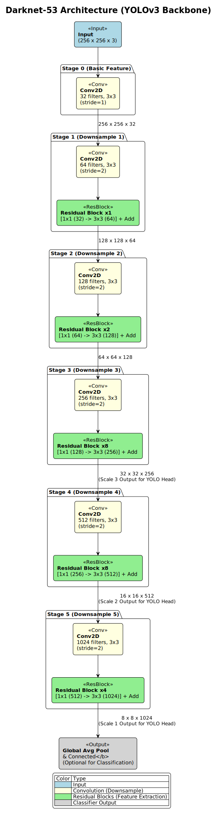

#### 关键组件

1. DBL 组件 (Darknet Conv2D_BN_Leaky)
   Darknet-53 中的最小卷积单元不仅仅是一个卷积操作，它通常包含三个部分，在代码中常被称为 DBL 或 CBL：
   1. Conv2d: 卷积层。
   2. Batch Normalization (BN): 批归一化，用于加速收敛并防止过拟合。
   3. Leaky ReLU: 激活函数。与普通 ReLU 不同，它在负数区域给出一个很小的斜率（通常是 0.1），防止神经元“死亡”。
2. 残差模块 (Residual Unit)
   这是 Darknet-53 能够加深网络的关键。一个残差模块包含：
   1. $1 \times 1$ 卷积： 用于压缩通道数（降维），减少参数量和计算量。
   2. $3 \times 3$ 卷积： 用于特征提取和恢复通道数。
   3. Add 操作： 将模块的输入直接加到 $3 \times 3$ 卷积的输出上（Element-wise addition）。
   结构如下:
   $$Input \rightarrow [1 \times 1 \text{ Conv}] \rightarrow [3 \times 3 \text{ Conv}] \rightarrow \text{Add}(Input) \rightarrow Output$$

## 多GPU训练

### 代码实现

```python
%matplotlib inline
import torch
from torch import nn
from torch.nn import functional as F
from d2l import torch as d2l

# 初始化模型参数
scale = 0.01
W1 = torch.randn(size=(20, 1, 3, 3)) * scale
b1 = torch.zeros(20)
W2 = torch.randn(size=(50, 20, 5, 5)) * scale
b2 = torch.zeros(50)
W3 = torch.randn(size=(800, 128)) * scale
b3 = torch.zeros(128)
W4 = torch.randn(size=(128, 10)) * scale
b4 = torch.zeros(10)
params = [W1, b1, W2, b2, W3, b3, W4, b4]

# 定义模型
def lenet(X, params):
    h1_conv = F.conv2d(input=X, weight=params[0], bias=params[1])
    h1_activation = F.relu(h1_conv)
    h1 = F.avg_pool2d(input=h1_activation, kernel_size=(2, 2), stride=(2, 2))
    h2_conv = F.conv2d(input=h1, weight=params[2], bias=params[3])
    h2_activation = F.relu(h2_conv)
    h2 = F.avg_pool2d(input=h2_activation, kernel_size=(2, 2), stride=(2, 2))
    h2 = h2.reshape(h2.shape[0], -1)
    h3_linear = torch.mm(h2, params[4]) + params[5]
    h3 = F.relu(h3_linear)
    y_hat = torch.mm(h3, params[6]) + params[7]
    return y_hat

# 交叉熵损失函数
loss = nn.CrossEntropyLoss(reduction='none')

def get_params(params, device):
    new_params = [p.to(device) for p in params]
    for p in new_params:
        p.requires_grad_()
    return new_params

new_params = get_params(params, d2l.try_gpu(0))
print('b1 权重:', new_params[1])
print('b1 梯度:', new_params[1].grad)

def allreduce(data):
    for i in range(1, len(data)):
        data[0][:] += data[i].to(data[0].device)
    for i in range(1, len(data)):
        data[i][:] = data[0].to(data[i].device)

data = [torch.ones((1,2), device=d2l.try_gpu(i)) for i in range(d2l.num_gpus())]
print("Before allreduce:\n", data[0])
allreduce(data)
print("After allreduce:\n", data[0])

data = torch.arange(20).reshape(4,5)
devices = [torch.device(f'cuda:{i}') for i in range(d2l.num_gpus())]
split = nn.parallel.scatter(data, devices)
print('input data:\n', data)
print('load into: \n', devices)
print('output: \n', split)

#@save
def split_batch(X, y, devices):
    """将X和y拆分到多个设备上"""
    assert X.shape[0] == y.shape[0]
    return (nn.parallel.scatter(X, devices),
            nn.parallel.scatter(y, devices))

def train_batch(X, y, device_params, devices, lr):
    X_shards, y_shards = split_batch(X, y, devices)
    # 在每个GPU上分别计算损失
    ls = [loss(lenet(X_shard, device_W), y_shard).sum()
          for X_shard, y_shard, device_W in zip(
              X_shards, y_shards, device_params)]
    for l in ls:  # 反向传播在每个GPU上分别执行
        l.backward()
    # 将每个GPU的所有梯度相加，并将其广播到所有GPU
    with torch.no_grad():
        for i in range(len(device_params[0])):
            allreduce(
                [device_params[c][i].grad for c in range(len(devices))])
    # 在每个GPU上分别更新模型参数
    for param in device_params:
        d2l.sgd(param, lr, X.shape[0]) # 在这里，我们使用全尺寸的小批量

def train(num_gpus, batch_size, lr):
    train_iter, test_iter = d2l.load_data_fashion_mnist(batch_size)
    devices = [d2l.try_gpu(i) for i in range(num_gpus)]
    # 将模型参数复制到num_gpus个GPU
    device_params = [get_params(params, d) for d in devices]
    num_epochs = 10
    animator = d2l.Animator('epoch', 'test acc', xlim=[1, num_epochs])
    timer = d2l.Timer()
    for epoch in range(num_epochs):
        timer.start()
        for X, y in train_iter:
            # 为单个小批量执行多GPU训练
            train_batch(X, y, device_params, devices, lr)
            torch.cuda.synchronize()
        timer.stop()
        # 在GPU0上评估模型
        animator.add(epoch + 1, (d2l.evaluate_accuracy_gpu(
            lambda x: lenet(x, device_params[0]), test_iter, devices[0]),))
    print(f'测试精度：{animator.Y[0][-1]:.2f}，{timer.avg():.1f}秒/轮，'
          f'在{str(devices)}')

train(num_gpus = 1, batch_size = 256, lr = 0.2)
```

### 使用pytorch库实现

```python
import torch
from torch import nn
from d2l import torch as d2l

#@save
def resnet18(num_classes, in_channels=1):
    """稍加修改的ResNet-18模型"""
    def resnet_block(in_channels, out_channels, num_residuals,
                     first_block=False):
        blk = []
        for i in range(num_residuals):
            if i == 0 and not first_block:
                blk.append(d2l.Residual(out_channels,
                                        use_1x1conv=True, strides=2))
            else:
                blk.append(d2l.Residual(out_channels))
        return nn.Sequential(*blk)

    # 该模型使用了更小的卷积核、步长和填充，而且删除了最大汇聚层
    net = nn.Sequential(
        nn.Conv2d(in_channels, 64, kernel_size=3, stride=1, padding=1),
        nn.BatchNorm2d(64),
        nn.ReLU())
    net.add_module("resnet_block1", resnet_block(
        64, 64, 2, first_block=True))
    net.add_module("resnet_block2", resnet_block(64, 128, 2))
    net.add_module("resnet_block3", resnet_block(128, 256, 2))
    net.add_module("resnet_block4", resnet_block(256, 512, 2))
    net.add_module("global_avg_pool", nn.AdaptiveAvgPool2d((1,1)))
    net.add_module("fc", nn.Sequential(nn.Flatten(),
                                       nn.Linear(512, num_classes)))
    return net

net = resnet18(10)
# 获取GPU列表
devices = d2l.try_all_gpus()
# 我们将在训练代码实现中初始化网络

def train(net, num_gpus, batch_size, lr):
    train_iter, test_iter = d2l.load_data_fashion_mnist(batch_size)
    devices = [d2l.try_gpu(i) for i in range(num_gpus)]
    def init_weights(m):
        if type(m) in [nn.Linear, nn.Conv2d]:
            nn.init.normal_(m.weight, std=0.01)
    net.apply(init_weights)
    # 在多个GPU上设置模型
    net = nn.DataParallel(net, device_ids=devices)
    trainer = torch.optim.SGD(net.parameters(), lr)
    loss = nn.CrossEntropyLoss()
    timer, num_epochs = d2l.Timer(), 10
    animator = d2l.Animator('epoch', 'test acc', xlim=[1, num_epochs])
    for epoch in range(num_epochs):
        net.train()
        timer.start()
        for X, y in train_iter:
            trainer.zero_grad()
            X, y = X.to(devices[0]), y.to(devices[0])
            l = loss(net(X), y)
            l.backward()
            trainer.step()
        timer.stop()
        animator.add(epoch + 1, (d2l.evaluate_accuracy_gpu(net, test_iter),))
    print(f'测试精度：{animator.Y[0][-1]:.2f}，{timer.avg():.1f}秒/轮，'
          f'在{str(devices)}')

train(net, num_gpus=1, batch_size=256, lr=0.1)
```

### 结果(单GPU)

手动实现结果如下：

```python
测试精度：0.83，1.1秒/轮，在[device(type='cuda', index=0)]
```

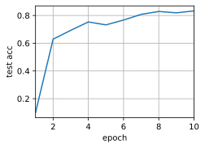

pytorch实现结果如下：

```python
测试精度：0.92，16.4秒/轮，在[device(type='cuda', index=0)]
```

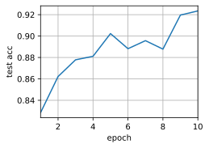

## 分布式训练

### 数据并行

假设你有一个巨大的数据集（比如ImageNet），我们把它切分成 $N$ 份，分配给 $N$ 个GPU（节点）。

* **模型副本**：每个GPU上都保存一份完全相同的模型参数副本。

* **数据分发**：在每一步迭代中，不同的GPU读取不同的数据小批量（Mini-batch）。

* **独立计算**：每个GPU根据自己读到的数据，独立计算梯度（Gradient）。

这时候问题来了：**每个GPU算出来的梯度是不一样的，怎么更新模型才能保证所有GPU上的模型参数始终保持一致？** 这就是同步SGD要解决的问题。

### 同步SGD

同步SGD的核心逻辑是：**“全员对齐，一起行动”**。它要求在进行下一次迭代前，所有GPU必须完成当前的梯度计算，并算出“平均梯度”来更新参数。

具体步骤如下：

1. 前向与反向传播 (Forward & Backward Pass)：

   所有的GPU（假设有 $k$ 个工作节点）同时开始工作。它们各自从本地数据中取出一个Batch，计算损失函数，并通过反向传播计算出各自的梯度 $g\_i$。

2. 同步与聚合 (Synchronization & Aggregation)：
   这是关键的一步。系统设立一个同步屏障（Barrier）。
   * 计算快的GPU必须**等待**计算慢的GPU。
   * 当所有GPU都完成了梯度计算后，系统会将所有GPU的梯度收集起来，计算平均梯度：
     $$g_{global} = \frac{1}{k} \sum_{i=1}^{k} g_i$$

3. 参数更新 (Parameter Update)：
   每个GPU利用这个相同的 $g\_{global}$ 来更新自己的模型参数 $w$：
   $$w_{t+1} = w_t - \eta \cdot g_{global}$$
   (其中 $\eta$ 是学习率)

4. 广播 (Broadcast)：
   （视架构而定）更新后的参数确保在所有GPU上是完全一致的，然后大家带着完全相同的参数进入下一轮迭代。

## 计算机视觉

### 数据增强

**数据增强 (Data Augmentation)** 的核心目的是通过**对现有训练数据进行一系列随机变换**，人为地扩充数据集的规模和多样性。

简单来说，就是让模型“见多识广”，防止它死记硬背（过拟合）。

#### 常见的图像数据增强方法

在计算机视觉（CV）领域，数据增强应用最为广泛。主要分为两类：

1. 几何变换 (Geometric Transformations)
改变图像的空间结构，但图像内容本身不变。
* **翻转 (Flip)**：水平翻转或垂直翻转。
* **旋转 (Rotation)**：随机旋转一定角度（如 -30° 到 30°）。
* **裁剪 (Crop)**：随机裁剪图片的一部分，或者中心裁剪。
* **缩放 (Resize/Scale)**：改变图片大小或长宽比。
* **平移 (Translation)**：将图像向上下左右移动。

2. 颜色/像素变换 (Color/Pixel Transformations)
改变图像的像素值，不改变形状。
* **色彩抖动 (Color Jitter)**：随机调整亮度、对比度、饱和度和色调。
* **噪声注入 (Noise Injection)**：加入高斯噪声或椒盐噪声，模拟低质量图片。
* **模糊 (Blur)**：使用高斯模糊等平滑图像。
* **擦除 (Cutout/Random Erasing)**：随机在图像上遮挡一块区域（迫使模型利用局部特征识别物体）。

#### 代码实现

引包，打印测试图片：

```python
%matplotlib inline
import torch
import torchvision
from torch import nn
from d2l import torch as d2l

d2l.set_figsize()
img = d2l.Image.open('./cat.webp')
d2l.plt.imshow(img)
```

resize后的图片如下：

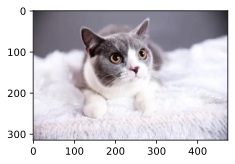

定义图片增强的应用函数：

```python
def apply(img, aug, num_rows=2, nums_cols=4, scale=1.5):
    Y = [aug(img) for _ in range(num_rows * nums_cols)]
    d2l.show_images(Y, num_rows, nums_cols, scale=scale)
```

使用torchvision自带的水平翻转：

```python
apply(img, torchvision.transforms.RandomHorizontalFlip())
```

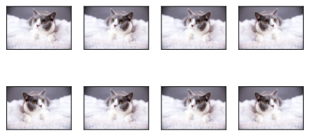

垂直翻转：

```python
apply(img, torchvision.transforms.RandomVerticalFlip())
```


局部放大缩小提取：

```python
shape_aug = torchvision.transforms.RandomResizedCrop(
    (200, 200), scale=(0.1, 1), ratio=(0.5, 2)
)
apply(img, shape_aug)
```


明暗，色差，对比度：

```python
color_aug = torchvision.transforms.ColorJitter(
    brightness=0.5, contrast=0.5, saturation=0.5, hue=0.5
)
apply(img, color_aug)
```

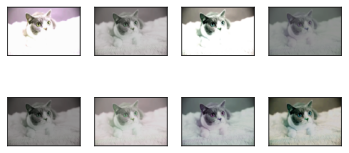

组合上面的效果：

```python
augs = torchvision.transforms.Compose(
    [
        torchvision.transforms.RandomHorizontalFlip(),
        color_aug,
        shape_aug
    ]
)
apply(img, augs)
```

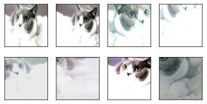

#### 使用数据增强的训练代码

下载数据集并显示前32张：

```python
all_images = torchvision.datasets.CIFAR10(
    train=True, root="../data", download=True
)
d2l.show_images(
    [all_images[i][0] for i in range(32)], 4, 8, scale=0.8
)
```

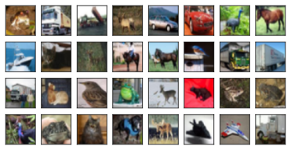

定义数据增强方法：（当前仅仅对于训练数据进行翻转）

```python
train_augs = torchvision.transforms.Compose(
    [
        torchvision.transforms.RandomHorizontalFlip(),
        torchvision.transforms.ToTensor()
    ]
)

test_augs = torchvision.transforms.Compose(
    [
        torchvision.transforms.ToTensor()
    ]
)
```

加载数据集：

```python
def load_cifar10(is_train, augs, batch_size):
    dataset = torchvision.datasets.CIFAR10(
        root="../data", train=is_train, transform=augs, download=True
    )
    dataloader = torch.utils.data.DataLoader(
        dataset, batch_size=batch_size, shuffle=is_train, num_workers=4
    )
    return dataloader
```

定义训练函数：

```python
#@save
def train_batch_ch13(net, X, y, loss, trainer, devices):
    """用多GPU进行小批量训练"""
    if isinstance(X, list):
        # 微调BERT中所需
        X = [x.to(devices[0]) for x in X]
    else:
        X = X.to(devices[0])
    y = y.to(devices[0])
    net.train()
    trainer.zero_grad()
    pred = net(X)
    l = loss(pred, y)
    l.sum().backward()
    trainer.step()
    train_loss_sum = l.sum()
    train_acc_sum = d2l.accuracy(pred, y)
    return train_loss_sum, train_acc_sum

#@save
def train_ch13(net, train_iter, test_iter, loss, trainer, num_epochs,
               devices=d2l.try_all_gpus()):
    """用多GPU进行模型训练"""
    timer, num_batches = d2l.Timer(), len(train_iter)
    animator = d2l.Animator(xlabel='epoch', xlim=[1, num_epochs], ylim=[0, 1],
                            legend=['train loss', 'train acc', 'test acc'])
    net = nn.DataParallel(net, device_ids=devices).to(devices[0])
    for epoch in range(num_epochs):
        # 4个维度：储存训练损失，训练准确度，实例数，特点数
        metric = d2l.Accumulator(4)
        for i, (features, labels) in enumerate(train_iter):
            timer.start()
            l, acc = train_batch_ch13(
                net, features, labels, loss, trainer, devices)
            metric.add(l, acc, labels.shape[0], labels.numel())
            timer.stop()
            if (i + 1) % (num_batches // 5) == 0 or i == num_batches - 1:
                animator.add(epoch + (i + 1) / num_batches,
                             (metric[0] / metric[2], metric[1] / metric[3],
                              None))
        test_acc = d2l.evaluate_accuracy_gpu(net, test_iter, device=devices[0])
        animator.add(epoch + 1, (None, None, test_acc))
    print(f'loss {metric[0] / metric[2]:.3f}, train acc '
          f'{metric[1] / metric[3]:.3f}, test acc {test_acc:.3f}')
    print(f'{metric[2] * num_epochs / timer.sum():.1f} examples/sec on '
          f'{str(devices)}')
```

定义训练参数：

```python
batch_size, devices, net = 256, d2l.try_all_gpus(), d2l.resnet18(10, 3)

def init_weights(m):
    if type(m) == nn.Linear or type(m) == nn.Conv2d:
        nn.init.xavier_uniform_(m.weight)
        
net.apply(init_weights)

def train_with_data_aug(train_augs, test_augs, net, lr=0.001):
    train_iter = load_cifar10(True, train_augs, batch_size)
    test_iter = load_cifar10(False, test_augs, batch_size)
    loss = nn.CrossEntropyLoss(reduction="none")
    trainer = torch.optim.Adam(net.parameters(), lr=lr)
    train_ch13(net, train_iter, test_iter, loss, trainer, 10, devices)
```

训练：

```python
train_with_data_aug(train_augs, test_augs, net)
```

测试结果：

```python
loss 0.215, train acc 0.925, test acc 0.828
2919.0 examples/sec on [device(type='cuda', index=0)]
```


给训练数据不添加翻转效果的训练结果：

```python
loss 0.109, train acc 0.961, test acc 0.785
2890.4 examples/sec on [device(type='cuda', index=0)]
```

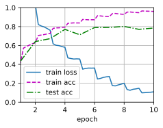

### 微调（迁移学习）

**微调 (Fine-tuning)** 是迁移学习中最核心、最常用的手段。它的基本思想是：**站在巨人的肩膀上**。

与其从零开始训练一个神经网络（随机初始化权重），我们使用在一个大规模数据集（如ImageNet或整个互联网文本）上预训练好的模型作为起点，针对我们的特定任务进行“微小的调整”。

1. 替换输出层 (Replace the Head)
这是微调的第一步，也是必做的一步。
* **原理**：预训练模型（Backbone）通常有一个特定的输出层。例如，ResNet在ImageNet上预训练，输出层有1000个节点（对应1000类）。但你的任务可能只有2类（猫 vs 狗）。
* **操作**：保留前面的所有层（特征提取器），切掉最后的**全连接层（Classifier Head）**，换成一个节点数等于你任务类别数的新层。
* **初始化**：前面的层加载预训练权重，新加的层使用随机初始化。

2. 冻结部分层 (Layer Freezing)
神经网络的不同层学习到的特征是不同的：
* **底层（靠近输入）**：学习通用的低级特征（如边缘、颜色、纹理）。这些特征在任何图像任务中都很通用。
* **高层（靠近输出）**：学习具体的语义特征（如“眼睛”、“车轮”）。这些特征与特定任务强相关。
基于此，我们有不同的冻结策略：
* **Linear Probing (线性探测)**：冻结**所有**骨干网络（Backbone），只训练最后新加的分类层。这适用于数据量极少且任务与预训练任务非常相似的情况。
* **逐步解冻 (Gradual Unfreezing)**：先只训练最后的新层，待收敛后，再解冻最后几个卷积层进行微调，倒数第二组解冻后再微调……直到（可能）解冻所有层。这能防止梯度剧烈波动破坏预训练的底层特征。

3. 差异化学习率 (Differential Learning Rates)
这是一个非常关键的技巧。
* **问题**：新加的层是随机初始化的，需要较大的梯度来快速学习；而预训练的层已经很完美了，只需要微小的改动。如果你用同样的大学习率去更新所有层，预训练好的权重会被破坏（灾难性遗忘）。
* **策略**：
  * **新层（Head）**：使用较大的学习率（例如 $\eta = 1e^{-3}$）。
  * **预训练层（Body）**：使用极小的学习率（例如 $\eta = 1e^{-5}$ 或 $1e^{-6}$）。
  * 甚至可以设置**层级衰减**：层数越深（越靠近底层），学习率越小。

4. 训练策略上的技巧 (Training Tricks)
* **Warm-up (热身)**：在训练刚开始时，先使用极小的学习率训练几个Epoch，然后再慢慢增加到设定的学习率。这是为了让新加的随机初始化层先“稳定”下来，避免一开始的剧烈梯度传到骨干网络。
* **早停 (Early Stopping)**：微调很容易在小数据集上过拟合，所以一旦验证集Loss不再下降，应立即停止训练。

#### 代码实现

导入包：

```python
%matplotlib inline
import os
import torch
import torchvision
from d2l import torch as d2l
from torch import nn
```

下载数据集：

```python
#@save
d2l.DATA_HUB['hotdog'] = (d2l.DATA_URL + 'hotdog.zip',
                         'fba480ffa8aa7e0febbb511d181409f899b9baa5')

data_dir = d2l.download_extract('hotdog')

train_imgs = torchvision.datasets.ImageFolder(os.path.join(data_dir, 'train'))
test_imgs = torchvision.datasets.ImageFolder(os.path.join(data_dir, 'test'))
```

查看数据：

```python
hotdogs = [train_imgs[i][0] for i in range(8)]
not_hotdogs = [train_imgs[-i - 1][0] for i in range(8)]
d2l.show_images(hotdogs + not_hotdogs, 2, 8, scale=1.4)
```

定义数据增强：

```python
# 使用RGB通道的均值和标准差，以标准化每个通道
# IMGNET数据集的均值和标准差
normalize = torchvision.transforms.Normalize(
    [0.485, 0.456, 0.406], [0.229, 0.224, 0.225])

train_augs = torchvision.transforms.Compose([
    torchvision.transforms.RandomResizedCrop(224),
    torchvision.transforms.RandomHorizontalFlip(),
    torchvision.transforms.ToTensor(),
    normalize])

test_augs = torchvision.transforms.Compose([
    torchvision.transforms.Resize([256, 256]),
    torchvision.transforms.CenterCrop(224),
    torchvision.transforms.ToTensor(),
    normalize])
```

使用IMGNET预训练的resnet18：

```python
pretrained_net = torchvision.models.resnet18(pretrained=True)

print(pretrained_net.fc)
```

其最后的全连接层如下：

```python
Linear(in_features=512, out_features=1000, bias=True)
```

使用预训练模型，修改最后的全连接层：

```python
finetune_net = torchvision.models.resnet18(pretrained=True)
finetune_net.fc = nn.Linear(finetune_net.fc.in_features, 2)
nn.init.xavier_uniform_(finetune_net.fc.weight)
```

定义训练函数：

```python
# 如果param_group=True，输出层中的模型参数将使用十倍的学习率
def train_fine_tuning(net, learning_rate, batch_size=128, num_epochs=5,
                      param_group=True):
    train_iter = torch.utils.data.DataLoader(torchvision.datasets.ImageFolder(
        os.path.join(data_dir, 'train'), transform=train_augs),
        batch_size=batch_size, shuffle=True)
    test_iter = torch.utils.data.DataLoader(torchvision.datasets.ImageFolder(
        os.path.join(data_dir, 'test'), transform=test_augs),
        batch_size=batch_size)
    devices = d2l.try_all_gpus()
    loss = nn.CrossEntropyLoss(reduction="none")
    if param_group:
        params_1x = [param for name, param in net.named_parameters()
             if name not in ["fc.weight", "fc.bias"]]
        trainer = torch.optim.SGD([{'params': params_1x},
                                   {'params': net.fc.parameters(),
                                    'lr': learning_rate * 10}],
                                lr=learning_rate, weight_decay=0.001)
    else:
        trainer = torch.optim.SGD(net.parameters(), lr=learning_rate,
                                  weight_decay=0.001)
    d2l.train_ch13(net, train_iter, test_iter, loss, trainer, num_epochs,
                   devices)
```

使用迁移学习训练：

```python
train_fine_tuning(finetune_net, 5e-5)
```

训练结果：

```python
loss 0.163, train acc 0.934, test acc 0.930
557.0 examples/sec on [device(type='cuda', index=0)]
```

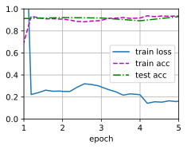

如果不使用预训练模型，直接训练：

```python
scrach_net = torchvision.models.resnet18()
scrach_net.fc = nn.Linear(scrach_net.fc.in_features, 2)
train_fine_tuning(scrach_net, 5e-4, param_group=False)
```

结果如下：

```python
loss 0.474, train acc 0.814, test acc 0.835
858.2 examples/sec on [device(type='cuda', index=0)]
```

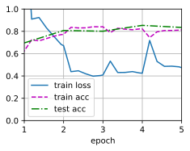

### 物体检测

#### 绘制框

引入包：

```python
%matplotlib inline
import torch
from d2l import torch as d2l
```

设置绘制图像大小并显示图片：

```python
# 设置图像显示的大小，使用 d2l 库提供的默认尺寸设置
d2l.set_figsize()

# 读取当前目录下的 catdog.jpg 图片文件
# plt.imread() 会将图片读取为一个数组（numpy array 或类似格式）
img = d2l.plt.imread('./catdog.jpg')

# 使用 matplotlib 显示读取的图片
# imshow() 函数会将图片数组渲染成可视化的图像
d2l.plt.imshow(img)
```

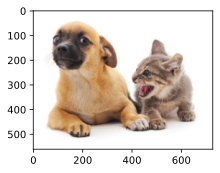

注意，上面的图片y轴最上面为0；下面是两种转换函数：

```python
def box_corner_to_center(boxes):
    """从(左上, 右下)格式转换为(中心, 宽度, 高度)格式
    
    参数说明：
    boxes: 形状为 (n, 4) 的张量，每行表示一个边界框
           格式为 [x1, y1, x2, y2]，即左上角和右下角坐标
    
    返回值：
    转换后的边界框，格式为 [cx, cy, w, h]
    其中 cx, cy 是中心点坐标，w, h 是宽度和高度
    """
    # 从 boxes 中提取左上角的 x 坐标（第1列）
    x1 = boxes[:, 0]
    # 从 boxes 中提取左上角的 y 坐标（第2列）
    y1 = boxes[:, 1]
    # 从 boxes 中提取右下角的 x 坐标（第3列）
    x2 = boxes[:, 2]
    # 从 boxes 中提取右下角的 y 坐标（第4列）
    y2 = boxes[:, 3]
    
    # 计算中心点的 x 坐标：(左边 + 右边) / 2
    cx = (x1 + x2) / 2
    # 计算中心点的 y 坐标：(上边 + 下边) / 2
    cy = (y1 + y2) / 2
    # 计算宽度：右边 x 坐标 - 左边 x 坐标
    w = x2 - x1
    # 计算高度：下边 y 坐标 - 上边 y 坐标
    h = y2 - y1
    
    # 使用 torch.stack 将四个一维张量堆叠成二维张量
    # axis=-1 表示在最后一个维度上堆叠，得到形状为 (n, 4) 的结果
    boxes = torch.stack((cx, cy, w, h), axis=-1)
    return boxes

def box_center_to_corner(boxes):
    """从(中心, 宽度, 高度)格式转换为(左上, 右下)格式
    
    参数说明：
    boxes: 形状为 (n, 4) 的张量，每行表示一个边界框
           格式为 [cx, cy, w, h]，即中心点坐标和宽高
    
    返回值：
    转换后的边界框，格式为 [x1, y1, x2, y2]
    其中 x1, y1 是左上角坐标，x2, y2 是右下角坐标
    """
    # 从 boxes 中提取中心点的 x 坐标（第1列）
    cx = boxes[:, 0]
    # 从 boxes 中提取中心点的 y 坐标（第2列）
    cy = boxes[:, 1]
    # 从 boxes 中提取宽度（第3列）
    w = boxes[:, 2]
    # 从 boxes 中提取高度（第4列）
    h = boxes[:, 3]
    
    # 计算左上角的 x 坐标：中心 x - 宽度的一半
    x1 = cx - 0.5 * w
    # 计算左上角的 y 坐标：中心 y - 高度的一半
    y1 = cy - 0.5 * h
    # 计算右下角的 x 坐标：中心 x + 宽度的一半
    x2 = cx + 0.5 * w
    # 计算右下角的 y 坐标：中心 y + 高度的一半
    y2 = cy + 0.5 * h
    
    # 使用 torch.stack 将四个一维张量堆叠成二维张量
    # axis=-1 表示在最后一个维度上堆叠，得到形状为 (n, 4) 的结果
    boxes = torch.stack((x1, y1, x2, y2), axis=-1)
    return boxes
```

手动验证转换函数是正确的：

```python
# 定义狗的边界框坐标（左上角和右下角）
# 格式：[左上角x, 左上角y, 右下角x, 右下角y]
# 坐标单位是像素，原点在图片左上角
dog_bbox = [60.0, 45.0, 378.0, 516.0]

# 定义猫的边界框坐标（左上角和右下角）
# 格式：[左上角x, 左上角y, 右下角x, 右下角y]
cat_bbox = [400.0, 112.0, 655.0, 493.0]

# 将两个边界框列表转换为 PyTorch 张量
# 转换后的 boxes 形状为 (2, 4)，即2个边界框，每个4个坐标值
boxes = torch.tensor((dog_bbox, cat_bbox))

# 测试格式转换函数的正确性
# 先将角点格式转换为中心格式，再转换回角点格式
# 使用 == 比较转换后的结果是否与原始 boxes 完全相同
# 如果转换函数正确，应该返回全为 True 的张量
box_center_to_corner(box_corner_to_center(boxes)) == boxes
```

输出应该为全真数组。下面是将左上右下格式转换为matplotlib格式：

```python
def bbox_to_rect(bbox, color):
    """将边界框(左上, 右下)格式转换为matplotlib格式(左上, 宽度, 高度)
    
    参数说明：
    bbox: 列表或数组，格式为 [x1, y1, x2, y2]
          x1, y1 是左上角坐标，x2, y2 是右下角坐标
    color: 字符串，指定矩形框的颜色，如 'blue', 'red' 等
    
    返回值：
    matplotlib.patches.Rectangle 对象，可以添加到图像上
    """
    # 创建并返回一个 matplotlib 的 Rectangle（矩形）对象
    return d2l.plt.Rectangle(
        # xy 参数：矩形左上角的坐标 (x, y)
        xy=(bbox[0], bbox[1]),
        # width 参数：矩形的宽度 = 右下角x - 左上角x
        width=bbox[2] - bbox[0],
        # height 参数：矩形的高度 = 右下角y - 左上角y
        height=bbox[3] - bbox[1],
        # fill 参数：False 表示不填充矩形内部，只画边框
        fill=False,
        # edgecolor 参数：边框的颜色
        edgecolor=color,
        # linewidth 参数：边框线条的宽度（像素）
        linewidth=2
    )

# 显示原始图片，并将返回的图像对象保存到 fig 变量
# 这样我们就可以在图片上添加其他元素（如边界框）
fig = d2l.plt.imshow(img)

# 在图像上添加狗的边界框（蓝色）
# fig.axes 是图像的坐标轴对象
# add_patch() 方法将矩形框添加到图像上
fig.axes.add_patch(bbox_to_rect(dog_bbox, 'blue'))

# 在图像上添加猫的边界框（红色）
fig.axes.add_patch(bbox_to_rect(cat_bbox, 'red'))
```

绘制出来的效果如下：

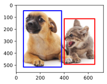


#### 数据集

引入包：

```python
%matplotlib inline
import os
import pandas as pd
import torch
import torchvision
from d2l import torch as d2l
```

定义d2l的数据格式，方便读取或者下载数据集：

```python
# 在 d2l 库的数据中心(DATA_HUB)中注册香蕉检测数据集
# DATA_HUB 是一个字典，存储了各种数据集的下载链接和校验码
d2l.DATA_HUB['banana-detection'] = (
    # 第一个元素：数据集的下载 URL
    # DATA_URL 是 d2l 库中定义的基础数据 URL
    d2l.DATA_URL + 'banana-detection.zip',
    # 第二个元素：数据集的 SHA-1 校验码，用于验证下载文件的完整性
    # 确保下载的文件没有损坏或被篡改
    '5de26c8fce5ccdea9f91267273464dc968d20d72'
)
```

读取数据集：

```python
def read_data_bananas(is_train=True):
    """读取香蕉检测数据集中的图像和标签
    
    参数说明：
    is_train: 布尔值，True 表示读取训练集，False 表示读取验证集
    
    返回值：
    images: 图像列表，每个元素是一个图像张量
    targets: 标签张量，形状为 (样本数, 1, 5)，包含类别和边界框坐标
    """
    # 下载并解压香蕉检测数据集，返回数据集所在的目录路径
    # 一般为../data/banana-detection
    data_dir = d2l.download_extract('banana-detection')
    
    # 构造 CSV 标签文件的完整路径
    # os.path.join() 用于拼接路径，适配不同操作系统
    # 根据 is_train 参数选择训练集或验证集的文件夹
    csv_fname = os.path.join(
        data_dir, 
        'bananas_train' if is_train else 'bananas_val',  # 选择训练或验证文件夹
        'label.csv'  # 标签文件名
    )
    
    # 使用 pandas 读取 CSV 文件
    # CSV 文件包含图像文件名和对应的标签信息（类别、边界框坐标）
    csv_data = pd.read_csv(csv_fname)
    
    # 将 'img_name' 列设置为索引，方便后续通过图像名称访问数据
    csv_data = csv_data.set_index('img_name')
    
    # 初始化两个空列表，用于存储图像和标签
    images, targets = [], []
    
    # 遍历 CSV 数据的每一行
    # iterrows() 返回索引（img_name）和该行数据（target）
    for img_name, target in csv_data.iterrows():
        # 读取并添加图像到 images 列表
        images.append(
            # torchvision.io.read_image() 读取图像文件并转换为张量
            torchvision.io.read_image(
                # 构造图像文件的完整路径
                os.path.join(
                    data_dir,  # 数据集根目录
                    'bananas_train' if is_train else 'bananas_val',  # 训练或验证文件夹
                    'images',  # 图像文件夹
                    f'{img_name}'  # 图像文件名（使用 f-string 格式化）
                )
            )
        )
        # 将当前行的标签数据转换为列表并添加到 targets
        # target 包含类别和边界框的坐标信息
        targets.append(list(target))
    
    # 将标签列表转换为 PyTorch 张量
    # unsqueeze(1) 在第二个维度增加一维，从 (n, 5) 变为 (n, 1, 5)
    # 除以 256 是为了将像素坐标归一化到 [0, 1] 范围
    # （假设图像尺寸为 256x256）
    return images, torch.tensor(targets).unsqueeze(1) / 256
```

定义数据集类, 简单起见， 只定义`getitem`, `len`方法：

```python
class BananasDataset(torch.utils.data.Dataset):
    """香蕉检测数据集类
    
    继承自 torch.utils.data.Dataset，这是 PyTorch 中自定义数据集的标准方式
    需要实现三个方法：__init__、__getitem__、__len__
    """
    
    def __init__(self, is_train=True):
        """初始化数据集
        
        参数说明：
        is_train: 布尔值，True 表示加载训练集，False 表示加载验证集
        """
        # 调用 read_data_bananas 函数读取图像和标签
        # self.features 存储所有图像数据
        # self.labels 存储所有标签数据
        self.features, self.labels = read_data_bananas(is_train)
        
        # 打印读取的样本数量，方便用户了解数据集大小
        # str(len(self.features)) 将样本数量转换为字符串
        # 使用三元运算符根据 is_train 选择不同的提示文本
        print('read ' + str(len(self.features)) + 
              (' training examples' if is_train else ' validation examples'))

    def __getitem__(self, idx):
        """获取指定索引的样本
        
        参数说明：
        idx: 整数，样本的索引位置
        
        返回值：
        元组 (图像, 标签)
        """
        # 返回第 idx 个样本
        # self.features[idx].float() 将图像张量转换为浮点型（便于后续计算）
        # self.labels[idx] 返回对应的标签
        return (self.features[idx].float(), self.labels[idx])

    def __len__(self):
        """返回数据集的样本总数
        
        返回值：
        整数，数据集中的样本数量
        """
        # 返回特征列表的长度，即样本总数
        return len(self.features)
```

定义加载数据集到内存的函数，一般情况下不能这么做，因为当前数据集较小，则直接加载到内存中：

```python
def load_data_bananas(batch_size):
    """加载香蕉检测数据集，返回训练和验证数据迭代器
    
    参数说明：
    batch_size: 整数，每个批次包含的样本数量
    
    返回值：
    train_iter: 训练集数据迭代器
    val_iter: 验证集数据迭代器
    """
    # 创建训练集的数据加载器（DataLoader）
    train_iter = torch.utils.data.DataLoader(
        # 第一个参数：BananasDataset 训练集对象
        BananasDataset(is_train=True),
        # 第二个参数：批次大小，决定每次迭代返回多少个样本
        batch_size,
        # shuffle=True：每个 epoch 开始时打乱数据顺序
        # 这有助于提高模型的泛化能力，避免学习到数据的顺序信息
        shuffle=True
    )
    
    # 创建验证集的数据加载器
    val_iter = torch.utils.data.DataLoader(
        # 第一个参数：BananasDataset 验证集对象
        BananasDataset(is_train=False),
        # 第二个参数：批次大小
        batch_size
        # 注意：验证集不需要打乱数据，所以没有 shuffle 参数
    )
    
    # 返回训练集和验证集的迭代器
    return train_iter, val_iter
```

设置一些参数，由于一张图中可能存在多个待检测物体，不应给每个batch给的很大；一般来说是给每个图限制其中最多有多少待检测物体。

```python
# 设置批次大小为 32（每次读取 32 个样本）
batch_size = 32

# 设置图像边长为 256 像素（用于后续坐标还原）
edge_size = 256

# 加载香蕉检测数据集，获取训练集和验证集的迭代器
train_iter, val_iter = load_data_bananas(batch_size)

# 从训练集迭代器中获取第一个批次的数据
# iter(train_iter) 将数据加载器转换为迭代器
# next() 获取迭代器的下一个元素（即第一个批次）
batch = next(iter(train_iter))

# 打印批次数据的形状
# batch[0] 是图像数据，形状为 (batch_size, channels, height, width)
# batch[1] 是标签数据，形状为 (batch_size, 1, 5)
# 5 个值分别是：类别、左上角x、左上角y、右下角x、右下角y（归一化坐标）
print(batch[0].shape, batch[1].shape)
```

注意，这里打印的消息如下：

```python
read 100 validation examples
torch.Size([32, 3, 256, 256]) torch.Size([32, 1, 5])
```

其中第一个tensor的内容是：【batch_size, RGP通道数, 图片长, 图片高】；第二个tensor的内容是：【batch_size, 每张图待检测物体上限, 类别+4个坐标点】

显示10张图片：

```python
# 从批次中取出前 10 张图像进行可视化
# batch[0][0:10] 选择前 10 个样本的图像
# permute(0,2,3,1) 调整张量维度顺序：
#   从 (batch, channels, height, width) 
#   变为 (batch, height, width, channels)
#   这是因为 matplotlib 显示图像需要 (height, width, channels) 格式
# 除以 255 将像素值从 [0, 255] 归一化到 [0, 1] 范围
imgs = (batch[0][0:10].permute(0, 2, 3, 1)) / 255

# 使用 d2l 库的 show_images 函数显示图像网格
# 参数说明：
#   imgs: 要显示的图像列表
#   2: 显示 2 行
#   5: 显示 5 列（总共 2x5=10 张图像）
#   scale=2: 图像显示的缩放比例
# 返回值 axes 是一个包含所有子图坐标轴对象的列表
axes = d2l.show_images(imgs, 2, 5, scale=2)

# 遍历每个子图和对应的标签，在图像上绘制边界框
# zip(axes, batch[1][0:10]) 将坐标轴和标签配对
for ax, label in zip(axes, batch[1][0:10]):
    # 在当前子图上显示边界框
    d2l.show_bboxes(
        ax,  # 当前子图的坐标轴对象
        # label[0][1:5] 提取边界框坐标（跳过第一个元素，即类别）
        # [1:5] 表示取索引 1 到 4 的元素：左上角x、左上角y、右下角x、右下角y
        # * edge_size 将归一化坐标 [0, 1] 还原为实际像素坐标 [0, 256]
        # 外层的 [] 是因为 show_bboxes 需要一个边界框列表
        [label[0][1:5] * edge_size],
        # colors=['w'] 设置边界框颜色为白色（white）
        colors=['w']
    )
```

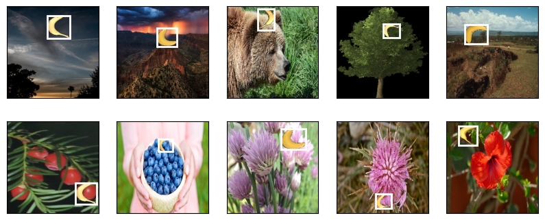

#### 锚框

锚框是预先在图像上定义好的一系列大小和比例固定的参考框。

在深度学习模型（如 Faster R-CNN, SSD, YOLO v3 等）进行预测时，它并不是凭空去猜目标在哪里，而是基于这些锚框进行两步走：

1. 分类：判断这个锚框里是否有物体，以及是什么物体。
2. 回归：如果框内有物体，微调锚框的边缘（偏移量），使其更精确地贴合目标的真实边界（Ground Truth）。

IoU（交并比）计算的是两个集合（通常是预测框 $A$ 和真实框 $B$）的交集面积与并集面积之比。其计算公式如下：

$$J(A,B)=\frac{\vert A \cap B \vert}{\vert A \cup B \vert}$$

赋予锚框标号：

* 每个锚框是一个训练样本
* 将每个锚框，要么标注背景，要么要么关联一个真实边缘框
* 真实数据集中会有大量锚框，这样会产生大量负类样本

我们需要将每个锚框分配到一个类别（某个物体或背景）以及一个偏移量。这个过程本质上是一个二分图匹配问题。可以参考d2l书籍的571页的例子。视频中描述不是很详细，现做描述如下：

分配算法，匈牙利算法的简化版本：假设有 $n$ 个锚框，$m$ 个真实框，我们会构建一个 $n \times m$ 的矩阵，其中每个元素是锚框 $A_i$ 与真实框 $G_j$ 的 IoU 值。

步骤如下：

1. 寻找全局最大值：在整个矩阵中找到 IoU 最大的单元格（假设是 $A_i$ 和 $G_j$）。
2. 锁定匹配：将 $G_j$ 分配给 $A_i$。此时，$A_i$ 就不再参与其他匹配，$G_j$ 也被“领走”了。
3. 剔除行列：从矩阵中删除第 $i$ 行和第 $j$ 列。
4. 循环往复：重复上述过程，直到所有的真实框 $G$ 都找到了对应的锚框。
5. 处理剩余锚框：
    * 对于那些没被选中的锚框，如果它与某个 $G$ 的 IoU 超过了预设阈值（如 0.5），也可以将其分配给该 $G$。
    * IoU 低于阈值的锚框全部设为 负样本（背景）。

去除重复框算法，极大值抑制（NMS）：

在目标检测的预测阶段（Inference），模型通常会针对同一个物体生成大量重叠的预测框。非极大值抑制（Non-Maximum Suppression, NMS） 的作用就是从这些重叠的框中，“压制”掉那些冗余的，只保留最精准的那一个。

步骤如下：

1. 排序：将所有框按置信度得分从高到低进行降序排列。得分最高的框被认为是最有可能是该物体的。
2. 选择与压制：
    1. 取最高分：从列表中取出得分最高的框（称其为 $A$），将其作为“最终保留框”存入结果列表。
    2. 计算 IoU：将剩余的所有框（$B, C, D...$）分别与这个 $A$ 计算 IoU（交并比）。
    3. 剔除重叠者：如果某个框与 $A$ 的 IoU 超过了预设的阈值（通常设为 0.5），说明这个框很可能是在重复预测同一个物体。直接把这个框从候选中删掉（抑制）。
3. 循环：在剩余的候选框中，重复上述步骤：再次取最高分，剔除高重叠框。直到候选列表变为空。

**锚框生成算法视频中讲的很粗糙，只是给出简单实现，现做说明如下：**

算法：基于缩放比和宽高比的组合：这是最基础的方法，即在特征图的每个像素中心，根据预设的参数生成一组锚框。

核心参数：
* 缩放比 (Scale, $s$)：指锚框相对于原始图像的大小（如 0.1, 0.2 等）。
* 宽高比 (Aspect Ratio, $r$)：指锚框的宽与高的比例（如 1:1[1], 1:2[0.5], 2:1[2]）。

那么锚框的宽高可以直接计算出来，设原始图像的宽为$w$高为$s$, 则：（可能有问题，以代码为主）
* 锚框的宽：$w \cdot \sqrt{s \cdot r}$
* 锚框的高：$\frac{h \cdot s}{\sqrt{r}}$

生成逻辑：

如果设定 $n$ 个缩放比 $[s_1, ..., s_n]$ 和 $m$ 个宽高比 $[r_1, ..., r_m]$，理论上每个像素点会产生 $n \times m$ 个锚框。但为了降低计算量，D2L 和许多算法通常只取包含 $s_1$ 或 $r_1$ 的组合，即：

$$(s_1, r_1), (s_1, r_2), \dots, (s_1, r_m), (s_2, r_1), (s_3, r_1), \dots, (s_n, r_1)$$

这样每个像素点只生成 $n + m - 1$ 个锚框。

代码实现如下：

```python
%matplotlib inline
import torch
from d2l import torch as d2l

# 设置PyTorch打印张量时只显示2位小数，方便查看结果
torch.set_printoptions(2)

def multibox_prior(data, sizes, ratios):
    """生成以每个像素为中心具有不同形状的锚框
    
    参数:
        data: 输入特征图，shape为(batch_size, channels, height, width)
        sizes: 锚框的尺度列表，如[0.75, 0.5, 0.25]
        ratios: 锚框的宽高比列表，如[1, 2, 0.5]
    返回:
        所有锚框的坐标，shape为(1, 锚框总数, 4)
    """
    # 获取输入特征图的高度和宽度
    in_height, in_width = data.shape[-2:]
    # 获取设备信息（CPU或GPU）、尺度数量、宽高比数量
    device, num_sizes, num_ratios = data.device, len(sizes), len(ratios)
    # 计算每个像素位置生成的锚框数量 = n + m - 1（避免重复计算size[0]*ratio[0]）
    boxes_per_pixel = (num_sizes + num_ratios - 1)
    # 将尺度列表转换为张量并放到相应设备上
    size_tensor = torch.tensor(sizes, device=device)
    # 将宽高比列表转换为张量并放到相应设备上
    ratio_tensor = torch.tensor(ratios, device=device)

    # 为了将锚点移动到像素的中心，需要设置偏移量。
    # 因为一个像素的高为1且宽为1，我们选择偏移我们的中心0.5
    offset_h, offset_w = 0.5, 0.5
    # 计算在y轴（高度）上的步长，将像素坐标归一化到[0,1]范围
    steps_h = 1.0 / in_height
    # 计算在x轴（宽度）上的步长，将像素坐标归一化到[0,1]范围
    steps_w = 1.0 / in_width

    # 生成锚框的所有中心点
    # 生成每个像素在高度方向的归一化中心坐标
    center_h = (torch.arange(in_height, device=device) + offset_h) * steps_h
    # 生成每个像素在宽度方向的归一化中心坐标
    center_w = (torch.arange(in_width, device=device) + offset_w) * steps_w
    # 使用meshgrid生成所有像素位置的网格坐标
    shift_y, shift_x = torch.meshgrid(center_h, center_w, indexing='ij')
    # 将二维网格展平成一维向量，方便后续处理
    shift_y, shift_x = shift_y.reshape(-1), shift_x.reshape(-1)

    # 生成"boxes_per_pixel"个高和宽，
    # 之后用于创建锚框的四角坐标(xmin,xmax,ymin,ymax)
    # 计算锚框的宽度：先根据第一个比例和所有尺度计算，再根据第一个尺度和其他比例计算
    w = torch.cat((size_tensor * torch.sqrt(ratio_tensor[0]),
                   sizes[0] * torch.sqrt(ratio_tensor[1:])))\
                   * in_height / in_width  # 乘以高宽比来处理矩形输入图像
    # 计算锚框的高度：同样的组合方式
    h = torch.cat((size_tensor / torch.sqrt(ratio_tensor[0]),
                   sizes[0] / torch.sqrt(ratio_tensor[1:])))
    # 将宽度和高度除以2来获得半宽和半高，构建相对于中心点的偏移
    # stack成(-w/2, -h/2, w/2, h/2)的形式，然后为每个像素位置重复
    anchor_manipulations = torch.stack((-w, -h, w, h)).T.repeat(
                                        in_height * in_width, 1) / 2

    # 每个中心点都将有"boxes_per_pixel"个锚框，
    # 所以生成含所有锚框中心的网格，重复了"boxes_per_pixel"次
    # 将每个像素的中心坐标堆叠4次（对应xmin, ymin, xmax, ymax）
    out_grid = torch.stack([shift_x, shift_y, shift_x, shift_y],
                dim=1).repeat_interleave(boxes_per_pixel, dim=0)
    # 中心坐标加上相对偏移得到最终的锚框坐标（xmin, ymin, xmax, ymax）
    output = out_grid + anchor_manipulations
    # 在第0维增加batch维度，返回shape为(1, 锚框总数, 4)
    return output.unsqueeze(0)

# 读取猫狗图片
img = d2l.plt.imread('./catdog.jpg')
# 获取图片的高度和宽度（前两个维度）
h, w = img.shape[:2]
# 打印图片尺寸信息
print (f'height: {h}, width: {w}')

# 创建一个随机张量模拟特征图，shape为(batch_size=1, channels=3, height=h, width=w)
X = torch.rand(size=(1, 3, h, w))
# 调用multibox_prior生成锚框
# sizes=[0.75, 0.5, 0.25]: 三种尺度
# ratios=[1, 2, 0.5]: 三种宽高比
# 每个像素会生成 3+3-1=5 个锚框
Y = multibox_prior(X, sizes=[0.75, 0.5, 0.25],
                      ratios=[1, 2, 0.5])
# 打印锚框张量的形状
# 输出: (batch_size=1, 锚框数量=h*w*5, 4个坐标值)
print(Y.shape)
# 输出：
# height: 561, width: 728
# torch.Size([1, 2042040, 4])

# 将锚框重新整形为(height, width, 每像素锚框数, 4个坐标)
boxes = Y.reshape(h, w, 5, 4)
# 查看位置(250, 250)处的第1个锚框的坐标
# 输出格式: [xmin, ymin, xmax, ymax]
print(boxes[250, 250, 0, :])
# tensor([0.06, 0.07, 0.63, 0.82])

def show_bboxes(axes, bboxes, labels=None, colors=None):
    """在图像上显示所有边界框
    
    参数:
        axes: matplotlib的坐标轴对象
        bboxes: 边界框列表，每个框为[xmin, ymin, xmax, ymax]
        labels: 每个框的标签文本（可选）
        colors: 每个框的颜色（可选）
    """
    def _make_list(obj, default_values=None):
        """辅助函数：将单个对象转换为列表"""
        # 如果对象为None，使用默认值
        if obj is None:
            obj = default_values
        # 如果不是列表或元组，转换为列表
        elif not isinstance(obj, (list, tuple)):
            obj = [obj]
        return obj

    # 将标签转换为列表形式
    labels = _make_list(labels)
    # 将颜色转换为列表，默认使用蓝、绿、红、品红、青色
    colors = _make_list(colors, ['b', 'g', 'r', 'm', 'c'])
    # 遍历所有边界框
    for i, bbox in enumerate(bboxes):
        # 循环使用颜色列表中的颜色
        color = colors[i % len(colors)]
        # 将边界框转换为matplotlib的矩形对象
        rect = d2l.bbox_to_rect(bbox.detach().numpy(), color)
        # 将矩形添加到图像上
        axes.add_patch(rect)
        # 如果提供了标签
        if labels and len(labels) > i:
            # 根据框的颜色选择文本颜色（白底用黑字，其他用白字）
            text_color = 'k' if color == 'w' else 'w'
            # 在矩形的左上角添加文本标签
            axes.text(rect.xy[0], rect.xy[1], labels[i],
                      va='center', ha='center', fontsize=9, color=text_color,
                      bbox=dict(facecolor=color, lw=0))

# 设置图形的显示大小
d2l.set_figsize()
# 创建缩放因子，用于将归一化坐标[0,1]还原到像素坐标
# (w, h, w, h)对应(xmin, ymin, xmax, ymax)的缩放
bbox_scale = torch.tensor((w, h, w, h))
# 显示原始图片
fig = d2l.plt.imshow(img)
# 在图片上绘制位置(250, 250)处的5个锚框
# 将归一化坐标乘以缩放因子得到像素坐标
show_bboxes(fig.axes, boxes[250, 250, :, :] * bbox_scale, [
    's=0.75, r=1',   # 尺度0.75，宽高比1:1
    's=0.5, r=1',    # 尺度0.5，宽高比1:1
    's=0.25, r=1',   # 尺度0.25，宽高比1:1
    's=0.75, r=2',   # 尺度0.75，宽高比2:1
    's=0.75, r=0.5'  # 尺度0.75，宽高比0.5:1
])
```

```python
def box_iou(boxes1, boxes2):
    """计算两个锚框或边界框列表中成对的交并比（IoU）
    
    参数:
        boxes1: 第一组边界框，shape为(N, 4)，格式为(xmin, ymin, xmax, ymax)
        boxes2: 第二组边界框，shape为(M, 4)，格式为(xmin, ymin, xmax, ymax)
    返回:
        IoU矩阵，shape为(N, M)，每个元素是boxes1[i]和boxes2[j]的IoU
    """
    # 定义Lambda函数计算边界框面积 = 宽度 × 高度
    box_area = lambda boxes: ((boxes[:, 2] - boxes[:, 0]) *
                              (boxes[:, 3] - boxes[:, 1]))
    # boxes1,boxes2,areas1,areas2的形状:
    # boxes1：(boxes1的数量,4),
    # boxes2：(boxes2的数量,4),
    # areas1：(boxes1的数量,),
    # areas2：(boxes2的数量,)
    # 计算第一组所有边界框的面积
    areas1 = box_area(boxes1)
    # 计算第二组所有边界框的面积
    areas2 = box_area(boxes2)
    # inter_upperlefts,inter_lowerrights,inters的形状:
    # (boxes1的数量,boxes2的数量,2)
    # 计算相交区域的左上角坐标：取两个框左上角的最大值
    # boxes1[:, None, :2]添加维度用于广播，shape变为(N, 1, 2)
    inter_upperlefts = torch.max(boxes1[:, None, :2], boxes2[:, :2])
    # 计算相交区域的右下角坐标：取两个框右下角的最小值
    inter_lowerrights = torch.min(boxes1[:, None, 2:], boxes2[:, 2:])
    # 计算相交区域的宽度和高度，如果不相交则为0（使用clamp限制最小值为0）
    inters = (inter_lowerrights - inter_upperlefts).clamp(min=0)
    # inter_areas和union_areas的形状:(boxes1的数量,boxes2的数量)
    # 计算相交区域的面积 = 宽 × 高
    inter_areas = inters[:, :, 0] * inters[:, :, 1]
    # 计算并集面积 = 面积1 + 面积2 - 交集面积
    union_areas = areas1[:, None] + areas2 - inter_areas
    # 返回IoU = 交集面积 / 并集面积
    return inter_areas / union_areas

#@save
def assign_anchor_to_bbox(ground_truth, anchors, device, iou_threshold=0.5):
    """将最接近的真实边界框分配给锚框
    
    参数:
        ground_truth: 真实边界框，shape为(M, 4)
        anchors: 锚框，shape为(N, 4)
        device: 计算设备
        iou_threshold: IoU阈值，默认0.5
    返回:
        anchors_bbox_map: 锚框到真实框的映射，shape为(N,)，-1表示背景
    """
    # 获取锚框数量和真实边界框数量
    num_anchors, num_gt_boxes = anchors.shape[0], ground_truth.shape[0]
    # 计算所有锚框和真实框之间的IoU矩阵
    # jaccard[i, j]表示第i个锚框和第j个真实框的IoU值
    jaccard = box_iou(anchors, ground_truth)
    # 创建锚框到真实框的映射张量，初始化为-1（表示背景）
    anchors_bbox_map = torch.full((num_anchors,), -1, dtype=torch.long,
                                  device=device)
    # 根据阈值，决定是否分配真实边界框
    # 对每个锚框，找到IoU最大的真实框及其IoU值
    max_ious, indices = torch.max(jaccard, dim=1)
    # 找出IoU大于等于阈值的锚框索引
    anc_i = torch.nonzero(max_ious >= iou_threshold).reshape(-1)
    # 获取这些锚框对应的最佳真实框索引
    box_j = indices[max_ious >= iou_threshold]
    # 将满足阈值条件的锚框分配给对应的真实框
    anchors_bbox_map[anc_i] = box_j
    # 创建用于标记已处理列的张量（填充-1）
    col_discard = torch.full((num_anchors,), -1)
    # 创建用于标记已处理行的张量（填充-1）
    row_discard = torch.full((num_gt_boxes,), -1)
    # 确保每个真实框至少分配给一个锚框（即使IoU小于阈值）
    for _ in range(num_gt_boxes):
        # 找到IoU矩阵中的最大值索引
        max_idx = torch.argmax(jaccard)
        # 将一维索引转换为二维坐标：真实框索引
        box_idx = (max_idx % num_gt_boxes).long()
        # 将一维索引转换为二维坐标：锚框索引
        anc_idx = (max_idx / num_gt_boxes).long()
        # 将该锚框分配给该真实框
        anchors_bbox_map[anc_idx] = box_idx
        # 将该真实框对应的列设为-1，避免重复分配
        jaccard[:, box_idx] = col_discard
        # 将该锚框对应的行设为-1，避免重复分配
        jaccard[anc_idx, :] = row_discard
    # 返回锚框到真实框的映射
    return anchors_bbox_map

def offset_boxes(anchors, assigned_bb, eps=1e-6):
    """计算锚框相对于分配的真实边界框的偏移量（用于训练）
    
    参数:
        anchors: 锚框，格式为(xmin, ymin, xmax, ymax)
        assigned_bb: 分配的真实边界框，格式相同
        eps: 极小值，防止除零或对数运算出错
    返回:
        偏移量，格式为(offset_x, offset_y, offset_w, offset_h)
    """
    # 将锚框从角点格式转换为中心格式(center_x, center_y, width, height)
    c_anc = d2l.box_corner_to_center(anchors)
    # 将真实框从角点格式转换为中心格式
    c_assigned_bb = d2l.box_corner_to_center(assigned_bb)
    # 计算中心点的偏移量：(真实框中心 - 锚框中心) / 锚框尺寸
    # 归一化后的偏移量，使其与锚框大小无关
    offset_xy = (c_assigned_bb[:, :2] - c_anc[:, :2]) / c_anc[:, 2:]
    # 计算宽高的偏移量：log(真实框尺寸 / 锚框尺寸)
    # 使用对数变换使得尺度变化更加平滑
    offset_wh = torch.log(eps + c_assigned_bb[:, 2:] / c_anc[:, 2:])
    # 拼接xy偏移和wh偏移，返回完整的偏移量
    return torch.cat([offset_xy, offset_wh], axis=1)

def multibox_target(anchors, labels):
    """使用真实边界框标记锚框（生成训练目标）
    
    参数:
        anchors: 所有锚框，shape为(1, N, 4)
        labels: 真实标签，shape为(batch_size, M, 5)，每行为(类别, xmin, ymin, xmax, ymax)
    返回:
        bbox_offset: 边界框偏移量，shape为(batch_size, N*4)
        bbox_mask: 掩码，标记哪些锚框需要参与损失计算
        class_labels: 类别标签，shape为(batch_size, N)
    """
    # 获取批次大小，并去除anchors的batch维度
    batch_size, anchors = labels.shape[0], anchors.squeeze(0)
    # 初始化三个列表，用于存储每个样本的结果
    batch_offset, batch_mask, batch_class_labels = [], [], []
    # 获取设备信息和锚框数量
    device, num_anchors = anchors.device, anchors.shape[0]
    # 遍历批次中的每个样本
    for i in range(batch_size):
        # 获取第i个样本的标签
        label = labels[i, :, :]
        # 将锚框分配给真实边界框
        # label[:, 1:]提取真实框坐标（去掉类别列）
        anchors_bbox_map = assign_anchor_to_bbox(
            label[:, 1:], anchors, device)
        # 创建边界框掩码：被分配的锚框（非背景）mask为1，背景为0
        # unsqueeze(-1)增加维度后repeat(1,4)，使每个坐标都有mask
        bbox_mask = ((anchors_bbox_map >= 0).float().unsqueeze(-1)).repeat(
            1, 4)
        # 将类标签和分配的边界框坐标初始化为零
        # 初始化所有锚框的类别标签为0（背景类）
        class_labels = torch.zeros(num_anchors, dtype=torch.long,
                                   device=device)
        # 初始化所有锚框的分配边界框坐标为0
        assigned_bb = torch.zeros((num_anchors, 4), dtype=torch.float32,
                                  device=device)
        # 使用真实边界框来标记锚框的类别。
        # 如果一个锚框没有被分配，标记其为背景（值为零）
        # 找到所有被分配了真实框的锚框索引（即非背景锚框）
        indices_true = torch.nonzero(anchors_bbox_map >= 0)
        # 获取这些锚框对应的真实框索引
        bb_idx = anchors_bbox_map[indices_true]
        # 为这些锚框分配类别标签（+1是因为0是背景类）
        class_labels[indices_true] = label[bb_idx, 0].long() + 1
        # 为这些锚框分配对应的真实框坐标
        assigned_bb[indices_true] = label[bb_idx, 1:]
        # 偏移量转换
        # 计算锚框相对于真实框的偏移量，并应用掩码（背景锚框的偏移量为0）
        offset = offset_boxes(anchors, assigned_bb) * bbox_mask
        # 将偏移量展平并添加到批次列表
        batch_offset.append(offset.reshape(-1))
        # 将掩码展平并添加到批次列表
        batch_mask.append(bbox_mask.reshape(-1))
        # 将类别标签添加到批次列表
        batch_class_labels.append(class_labels)
    # 将列表堆叠成张量，shape为(batch_size, ...)
    bbox_offset = torch.stack(batch_offset)
    bbox_mask = torch.stack(batch_mask)
    class_labels = torch.stack(batch_class_labels)
    # 返回偏移量、掩码和类别标签
    return (bbox_offset, bbox_mask, class_labels)

# 定义真实边界框：格式为[类别, xmin, ymin, xmax, ymax]
# 类别0是狗，类别1是猫
ground_truth = torch.tensor([[0, 0.1, 0.08, 0.52, 0.92],   # 狗的边界框
                         [1, 0.55, 0.2, 0.9, 0.88]])  # 猫的边界框
# 定义5个手动创建的锚框用于演示
anchors = torch.tensor([[0, 0.1, 0.2, 0.3],      # 锚框0
                    [0.15, 0.2, 0.4, 0.4],    # 锚框1
                    [0.63, 0.05, 0.88, 0.98], # 锚框2
                    [0.66, 0.45, 0.8, 0.8],   # 锚框3
                    [0.57, 0.3, 0.92, 0.9]])  # 锚框4

# 显示图片
fig = d2l.plt.imshow(img)
# 绘制真实边界框（ground_truth[:, 1:]去掉类别列）
# 使用黑色('k')标记，标签为'dog'和'cat'
show_bboxes(fig.axes, ground_truth[:, 1:] * bbox_scale, ['dog', 'cat'], 'k')
# 绘制锚框，使用默认颜色，标签为锚框编号
show_bboxes(fig.axes, anchors * bbox_scale, ['0', '1', '2', '3', '4'])
```
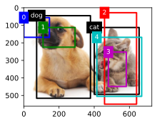
```python
# 调用multibox_target生成训练标签
# unsqueeze(dim=0)为anchors和ground_truth添加batch维度
labels = multibox_target(anchors.unsqueeze(dim=0), ground_truth.unsqueeze(dim=0))

# 打印类标签（labels[2]）
# 0表示背景，1表示狗，2表示猫
print(labels[2])

# 打印边界框偏移量（labels[0]）
# 每四个值(offset_x, offset_y, offset_w, offset_h)表示一个锚框的偏移
print(labels[0])
# 打印边界框掩码（labels[1]）
# 值为1表示该位置需要参与损失计算，0表示背景不参与
print(labels[1])

# tensor([[0, 1, 2, 0, 2]]) 
# tensor([[-0.00e+00, -0.00e+00, -0.00e+00, -0.00e+00,  1.40e-01,  1.00e+00,
#           5.19e-01,  1.44e+00, -1.20e-01,  2.69e-02,  3.36e-01, -3.13e-01,
#          -0.00e+00, -0.00e+00, -0.00e+00, -0.00e+00, -5.71e-02, -1.00e-01,
#           8.34e-07,  1.25e-01]])
# tensor([[0., 0., 0., 0., 1., 1., 1., 1., 1., 1., 1., 1., 0., 0., 0., 0., 1., 1.,
#          1., 1.]])

def offset_inverse(anchors, offset_preds):
    """根据锚框和预测的偏移量反推出预测的边界框（用于推理）
    
    参数:
        anchors: 锚框，格式为(xmin, ymin, xmax, ymax)
        offset_preds: 模型预测的偏移量，格式为(offset_x, offset_y, offset_w, offset_h)
    返回:
        predicted_bbox: 预测的边界框，格式为(xmin, ymin, xmax, ymax)
    """
    # 将锚框从角点格式转换为中心格式
    anc = d2l.box_corner_to_center(anchors)
    # 根据预测的中心偏移量计算预测框的中心坐标
    # 公式：预测中心 = 锚框中心 + (预测偏移 × 锚框尺寸 / 10)
    # 除以10是经验性的缩放因子
    pred_bbox_xy = (offset_preds[:, :2] * anc[:, 2:] / 10) + anc[:, :2]
    # 根据预测的尺寸偏移量计算预测框的宽高
    # 公式：预测尺寸 = 锚框尺寸 × exp(预测偏移 / 5)
    # 除以5是经验性的缩放因子
    pred_bbox_wh = torch.exp(offset_preds[:, 2:] / 5) * anc[:, 2:]
    # 拼接中心坐标和宽高，得到中心格式的预测框
    pred_bbox = torch.cat((pred_bbox_xy, pred_bbox_wh), axis=1)
    # 将预测框从中心格式转换回角点格式
    predicted_bbox = d2l.box_center_to_corner(pred_bbox)
    return predicted_bbox

def nms(boxes, scores, iou_threshold):
    """非极大值抑制（NMS）：去除重叠的冗余边界框
    
    参数:
        boxes: 所有预测边界框，shape为(N, 4)
        scores: 每个框的置信度分数，shape为(N,)
        iou_threshold: IoU阈值，超过此值的框会被抑制
    返回:
        keep: 保留的边界框索引列表
    """
    # 按置信度从高到低对边界框进行排序，B存储排序后的索引
    B = torch.argsort(scores, dim=-1, descending=True)
    # 初始化保留列表，用于存储最终保留的边界框索引
    keep = []
    # 循环直到所有框都被处理
    while B.numel() > 0:
        # 取出当前置信度最高的框的索引
        i = B[0]
        # 将其添加到保留列表
        keep.append(i)
        # 如果只剩一个框，结束循环
        if B.numel() == 1: break
        # 计算当前框与剩余所有框的IoU
        iou = box_iou(boxes[i, :].reshape(-1, 4),
                      boxes[B[1:], :].reshape(-1, 4)).reshape(-1)
        # 找出IoU小于等于阈值的框的索引（这些框与当前框重叠不大，需要保留）
        inds = torch.nonzero(iou <= iou_threshold).reshape(-1)
        # 更新B，只保留IoU小于阈值的框（+1是因为inds相对于B[1:]）
        B = B[inds + 1]
    # 返回保留的边界框索引张量
    return torch.tensor(keep, device=boxes.device)

def multibox_detection(cls_probs, offset_preds, anchors, nms_threshold=0.5,
                       pos_threshold=0.009999999):
    """使用非极大值抑制来预测边界框（完整的预测流程）
    
    参数:
        cls_probs: 类别概率，shape为(batch_size, 类别数+1, 锚框数)
        offset_preds: 预测的偏移量，shape为(batch_size, 锚框数*4)
        anchors: 锚框，shape为(1, 锚框数, 4)
        nms_threshold: NMS的IoU阈值
        pos_threshold: 正类的置信度阈值
    返回:
        预测结果，shape为(batch_size, 锚框数, 6)，每行为(类别, 置信度, xmin, ymin, xmax, ymax)
    """
    # 获取设备信息和批次大小
    device, batch_size = cls_probs.device, cls_probs.shape[0]
    # 去除anchors的batch维度
    anchors = anchors.squeeze(0)
    # 获取类别数（不包括背景）和锚框数量
    num_classes, num_anchors = cls_probs.shape[1], cls_probs.shape[2]
    # 初始化输出列表
    out = []
    # 遍历批次中的每个样本
    for i in range(batch_size):
        # 获取第i个样本的类别概率和偏移量预测
        cls_prob, offset_pred = cls_probs[i], offset_preds[i].reshape(-1, 4)
        # 对每个锚框，找出最大概率的类别及其置信度
        # cls_prob[1:]排除背景类
        conf, class_id = torch.max(cls_prob[1:], 0)
        # 根据锚框和预测偏移量计算预测的边界框
        predicted_bb = offset_inverse(anchors, offset_pred)
        # 使用NMS去除冗余的边界框，返回保留的索引
        keep = nms(predicted_bb, conf, nms_threshold)

        # 找到所有的non_keep索引，并将类设置为背景
        # 创建所有锚框的索引
        all_idx = torch.arange(num_anchors, dtype=torch.long, device=device)
        # 合并保留索引和所有索引
        combined = torch.cat((keep, all_idx))
        # 找出只出现一次的索引（即non_keep）
        uniques, counts = combined.unique(return_counts=True)
        non_keep = uniques[counts == 1]
        # 将keep和non_keep拼接，保持keep在前
        all_id_sorted = torch.cat((keep, non_keep))
        # 将non_keep的框标记为背景（类别-1）
        class_id[non_keep] = -1
        # 按排序后的索引重新排列类别ID
        class_id = class_id[all_id_sorted]
        # 按排序后的索引重新排列置信度和预测框
        conf, predicted_bb = conf[all_id_sorted], predicted_bb[all_id_sorted]
        # pos_threshold是一个用于非背景预测的阈值
        # 找出置信度低于阈值的框
        below_min_idx = (conf < pos_threshold)
        # 将这些框标记为背景
        class_id[below_min_idx] = -1
        # 将低置信度转换为1-conf（表示是背景的置信度）
        conf[below_min_idx] = 1 - conf[below_min_idx]
        # 拼接类别ID、置信度和预测框坐标，形成最终预测信息
        pred_info = torch.cat((class_id.unsqueeze(1),
                               conf.unsqueeze(1),
                               predicted_bb), dim=1)
        # 添加到输出列表
        out.append(pred_info)
    # 堆叠所有样本的结果并返回
    return torch.stack(out)

# 定义4个锚框用于演示NMS
anchors = torch.tensor([[0.1, 0.08, 0.52, 0.92],   # 锚框0
                      [0.08, 0.2, 0.56, 0.95],   # 锚框1
                      [0.15, 0.3, 0.62, 0.91],   # 锚框2
                      [0.55, 0.2, 0.9, 0.88]])   # 锚框3
# 假设模型预测的偏移量都为0（即预测框等于锚框）
offset_preds = torch.tensor([0] * anchors.numel())
# 定义类别概率（3个类别：背景、狗、猫）
cls_probs = torch.tensor([[0] * 4,               # 背景的预测概率（全为0）
                      [0.9, 0.8, 0.7, 0.1],  # 狗的预测概率
                      [0.1, 0.2, 0.3, 0.9]]) # 猫的预测概率

# 显示图片
fig = d2l.plt.imshow(img)
# 绘制4个锚框及其预测的类别和置信度
show_bboxes(fig.axes, anchors * bbox_scale,
            ['dog=0.9',  # 锚框0：预测为狗，置信度0.9
             'dog=0.8',  # 锚框1：预测为狗，置信度0.8
             'dog=0.7',  # 锚框2：预测为狗，置信度0.7
             'cat=0.9']) # 锚框3：预测为猫，置信度0.9
```
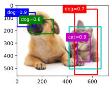
```python
# 调用multibox_detection进行预测
# unsqueeze(dim=0)为所有输入添加batch维度
output = multibox_detection(cls_probs.unsqueeze(dim=0),
                            offset_preds.unsqueeze(dim=0),
                            anchors.unsqueeze(dim=0),
                            nms_threshold=0.5)  # NMS的IoU阈值设为0.5
# 输出结果，每行格式为(类别ID, 置信度, xmin, ymin, xmax, ymax)
# 类别ID为-1表示背景或被NMS抑制的框
print(output)

"""
tensor([[[ 0.00,  0.90,  0.10,  0.08,  0.52,  0.92],
         [ 1.00,  0.90,  0.55,  0.20,  0.90,  0.88],
         [-1.00,  0.80,  0.08,  0.20,  0.56,  0.95],
         [-1.00,  0.70,  0.15,  0.30,  0.62,  0.91]]])
"""

# 显示图片
fig = d2l.plt.imshow(img)
# 遍历第一个样本的所有预测结果
for i in output[0].detach().numpy():
    # 如果类别ID为-1（背景），跳过不绘制
    if i[0] == -1:
        continue
    # 构建标签文本：'dog='或'cat=' + 置信度
    # i[0]为类别索引（0表示狗，1表示猫）
    label = ('dog=', 'cat=')[int(i[0])] + str(i[1])
    # 绘制预测框，i[2:]提取坐标(xmin, ymin, xmax, ymax)
    show_bboxes(fig.axes, [torch.tensor(i[2:]) * bbox_scale], label)
```
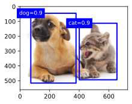

注：以上代码在2026年已经几乎不常用了，不必深究。

#### R-CNN 区域卷积神经网络

R-CNN 的核心思想可以概括为：先寻找候选区域，再利用 CNN 提取特征。

##### 算法流程：

1. 生成候选区域 (Region Proposals)： 使用 Selective Search 算法从输入图像中提取约 2000 个可能包含物体的候选框。这些框大小不一。
2. 特征提取：
    * 由于 CNN 的全连接层要求输入尺寸固定，R-CNN 将每个候选框强制缩放（Warping）到统一大小（如 $224 \times 224$）。
    * 将缩放后的图像输入预训练的 CNN（如 AlexNet）提取特征，得到一个固定长度的特征向量。
3. SVM 分类： 将特征向量输入到为每个类别训练的线性 SVM 中，判断该框属于哪个类别（包括背景）。
4. 边框回归 (Bounding Box Regression)： 使用回归器对候选框的位置进行精修，使其更贴合真实物体边界。

由于 R-CNN 太慢，Ross Girshick 推出了 Fast R-CNN。其中的关键改进就是：不再对 2000 个原始候选框运行 CNN，而是只对整张图运行一次 CNN，得到特征图（Feature Map），然后通过 RoI 池化 从特征图中“抠出”对应区域。

##### 运作原理：

假设我们预设的输出尺寸为 $H \times W$（例如 $7 \times 7$）：
1. 映射坐标： 将原图上的候选框坐标映射到特征图（Feature Map）上。
2. 划分子窗口： 将映射后的 RoI 区域划分为 $H \times W$ 个网格（Bins）。如果区域大小为 $h \times w$，那么每个网格的大小约为 $(h/H) \times (w/W)$。
3. 最大池化 (Max Pooling)： 在每个网格内取最大值作为该网格的输出。
4. 拼接结果： 所有网格处理完毕后，就得到了一个固定大小为 $H \times W$ 的特征图。

##### Faster R-CNN：

在 Faster R-CNN 之前，候选区域（Region Proposals）通常由 Selective Search 算法生成。这个算法运行在 CPU 上，处理一张图需要约 2 秒钟，成了整个系统的速度“拖油瓶”。

Faster R-CNN 的伟大之处在于：它取消了外部的候选区域算法，设计了一个 RPN (Region Proposal Network，区域生成网络)，让网络自己去学习“哪里可能有物体”。

RPN工作原理：

1. 特征图输入： RPN 共享了主干网络（Backbone，如 VGG16 或 ResNet）生成的特征图（Feature Map）。
2. 滑动窗口与锚点（Anchors）： 在特征图上的每个像素点，RPN 会预设 $k$ 个不同尺度（Scale）和长宽比（Aspect Ratio）的候选框，这些框被称为 Anchors。
    * 通常使用 3 种尺度和 3 种比例，即每个像素点对应 $k=9$ 个 Anchors。
3. 多任务输出：
    * 分类分支 (Classification)： 判断每个 Anchor 是前景（物体）还是背景。
    * 回归分支 (Regression)： 计算 Anchor 偏离真实物体边界（Ground Truth）的偏移量（$\Delta x, \Delta y, \Delta w, \Delta h$）。

Faster R-CNN完整流程如下：

1. 特征提取： 整张图像输入 CNN，得到共享的特征图。
2. 生成候选框： RPN 在特征图上滑动，筛选出得分较高的候选区域（Proposals）。
3. RoI Pooling： 将这些大小不一的候选区域在特征图上对应的部分切出来，并固定到统一尺寸。
4. 分类与精修： 经过全连接层，最后由两个输出头完成：
    * 具体类别的分类（是猫、是狗、还是车？）。
    * 更精确的边框回归（对 RPN 生成的框进行二次修正）。

##### Mask R-CNN:

Mask R-CNN = Faster R-CNN + Mask 预测分支。它不仅能告诉你图中有什么、在哪里，还能精确到像素级地勾勒出物体的轮廓（即“实例分割”，Instance Segmentation）。

Mask R-CNN 在 Faster R-CNN 的基础上增加了一个并行的分支，用于预测每个感兴趣区域（RoI）内的二值掩码（Binary Mask）。

* 分类分支： 预测物体的类别（是人、是车？）。
* 检测分支： 预测物体的边界框（Bounding Box 回归）。
* Mask 分支： 预测物体的像素级遮罩（使用全卷积网络 FCN 实现）。

一个关键技术改进：RoI Align

这是 Mask R-CNN 最具技术含量的改进。在之前的 RoI Pooling 中，为了将不同大小的框对齐到固定尺寸，需要进行“取整（Quantization）”操作。

* RoI Pooling 的问题： 取整会导致像素级的偏差。对于边界框检测来说，几像素的偏差影响不大；但对于像素级分割来说，几像素的位移会导致 Mask 无法对齐物体边缘。
* RoI Align 的方案：
    1. 取消取整： 保留所有的浮点数坐标。
    2. 双线性插值（Bilinear Interpolation）： 在每个网格单元中设置 4 个采样点，利用插值算法精确计算出这些点在特征图上的值。
    3. 聚合： 对采样点取最大值或平均值。

通过 RoI Align，特征图与原始图像实现了像素级的精确对齐，这是实现高质量分割的前提。

##### 双线性插值

在 RoI Align 中，双线性插值（Bilinear Interpolation） 是核心灵魂。它的作用是：当一个采样点的坐标是浮点数（不在像素中心）时，通过周围四个整数像素点的值，推算出这个点的数值。

在 RoI Pooling 中，如果计算出的坐标是 2.7，算法会直接取整变成 2。这种“四舍五入”会导致特征图上的位置偏移，反映回原图可能就是几十像素的误差。

但是，RoI Align 不取整。 如果坐标是 2.7，它就直接停在 2.7 的位置上。但问题来了：计算机里的图像（特征图）是离散的，只有坐标 (2,2), (2,3) 等整数点有值。2.7 这个位置没有现成的值，怎么办？ 这就需要双线性插值来“算”出来。

双线性插值其实就是在两个方向上分别做线性插值：

假设我们要计算点 $P(x, y)$ 的值，它落在周围四个整数像素点 $Q_{11}, Q_{12}, Q_{21}, Q_{22}$ 之间。

1. 水平方向插值（x 方向）
   我们先在左右两对点之间进行线性插值，找到两个中间点 $R_1$ 和 $R_2$ 的值：
   * 根据 $P$ 的 $x$ 坐标，在 $Q_{11}$ 和 $Q_{21}$ 之间插值得到 $R_1$。
   * 根据 $P$ 的 $x$ 坐标，在 $Q_{12}$ 和 $Q_{22}$ 之间插值得到 $R_2$。
2. 垂直方向插值（y 方向）
   现在我们有了 $R_1$ 和 $R_2$，再根据 $P$ 的 $y$ 坐标，在这两个点之间进行最后一次插值。

插值的计算如下：

设四个点坐标分别为 $(x_1, y_1), (x_1, y_2), (x_2, y_1), (x_2, y_2)$，则 $f(x,y)$ 近似为：

$$f(x,y) \approx \frac{1}{(x_2-x_1)(y_2-y_1)} \sum_{i=1}^2 \sum_{j=1}^2 f(Q_{ij}) \cdot \text{weight}_{ij}$$

#### SSD 单发多框检测

SSD算法主要为了继续加速。SSD 的核心精髓在于：“一步到位”和“多尺度检测”。

##### 核心思想：单次检测 (Single Shot)

与 R-CNN 系列（Two-stage）不同，SSD 属于 One-stage 算法。

* Two-stage (如 Faster R-CNN)： 第一步先找可能哪里有物体（RPN），第二步再看这是什么物体（R-CNN head）。
* One-stage (如 SSD, YOLO)： 只有一步。直接在特征图上进行密集采样，同时预测物体的类别和位置偏移。

##### 两个技术创新

1. 多尺度特征图检测 (Multi-scale Feature Maps)
   * 在 CNN 提取特征的过程中，特征图的尺寸会逐渐变小。
   * 底层特征图（较大）： 感受野小，分辨率高，适合检测小物体。
   * 高层特征图（较小）： 感受野大，语义信息强，适合检测大物体。
   * SSD 直接在 6 个不同尺度的特征图上分别进行预测，从而实现了对不同大小物体的全覆盖。
2. 预设框 (Default Boxes / Priors)
   类似于 Faster R-CNN 的 Anchors。SSD 在每个特征图的每个像素点上，预设了多个不同比例（如 1:1, 1:2, 2:1 等）和大小的框。
   * 网络不需要凭空预测物体的坐标。
   * 网络只需要预测：这个预设框里有没有物体？ 以及 物体真实边界相对于这个预设框的偏移量是多少。

##### SSD 算法完整执行流程

1. 图像预处理 (Input)
   SSD 对输入图像的尺寸有严格要求。最常见的是 SSD300（输入尺寸 $300 \times 300$）和 SSD512。
   * 图像进入网络前会被统一缩放，并进行减均值等归一化处理。
2. 基础网络特征提取 (Backbone)
   SSD 采用传统的 VGG16 作为基础网络（Backbone），但做了两处关键修改：
   * 去头： 删除了 VGG16 原有的全连接层（FC6, FC7），将其转换成卷积层。
   * 空洞卷积： 为了增加感受野同时保持分辨率，将某些卷积层替换为带孔卷积（Atrous/Dilated Convolution）。
3. 多尺度特征层生成 (Extra Feature Layers)
   在 VGG16 之后，SSD 又额外堆叠了数层卷积层，使得特征图的尺寸不断减小（例如从 $38 \times 38$ 降到 $19 \times 19$、$10 \times 10$ 直至 $1 \times 1$）。
   * 关键点： SSD 选择了其中的 6 层 特征图作为预测层。这种“金字塔”结构让它能够兼顾大物体和小物体的检测。
4. 密集预测 (Prediction)
   这是 SSD 最核心的一步。对于选定的 6 个特征图，每一个都会通过一个 $3 \times 3$ 的卷积核进行检测：
   1. 预设框 (Default Boxes)： 在特征图的每个像素点上，生成 $k$ 个不同比例的初始框。
   2. 分类输出： 为每个预设框预测 $C$ 个类别的置信度（$C$ 为类别总数 + 1 个背景类）。
   3. 回归输出： 为每个预设框预测 4 个偏移量（$\Delta x, \Delta y, \Delta w, \Delta h$），用于修正预设框的位置。
   > 计算量估算： 仅 SSD300 一个模型，全图生成的预测框总数就高达 8732 个。这种密集的采样保证了极高的召回率。
5. 后处理与 NMS (Post-processing)
   由于生成了近九千个预测框，会有大量冗余的框重叠在同一个物体上：
   * 置信度过滤： 首先剔除分类得分过低（如低于 0.5）的框。
   * 非极大值抑制 (NMS)： 核心步骤。对于重叠度（IoU）较高的框，只保留得分最高的那一个，删掉其余重复的框。


